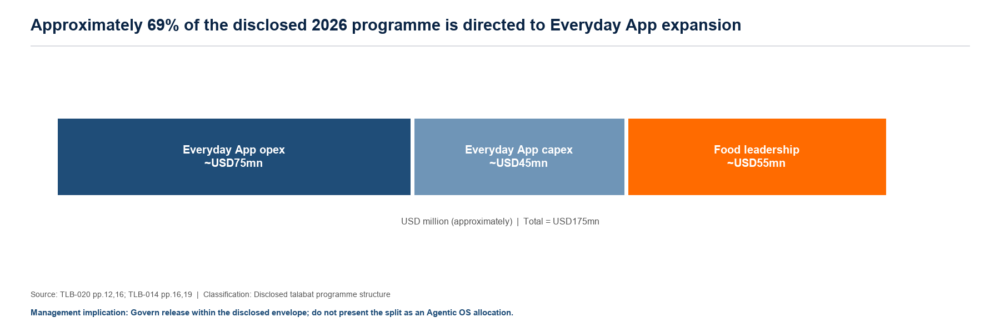
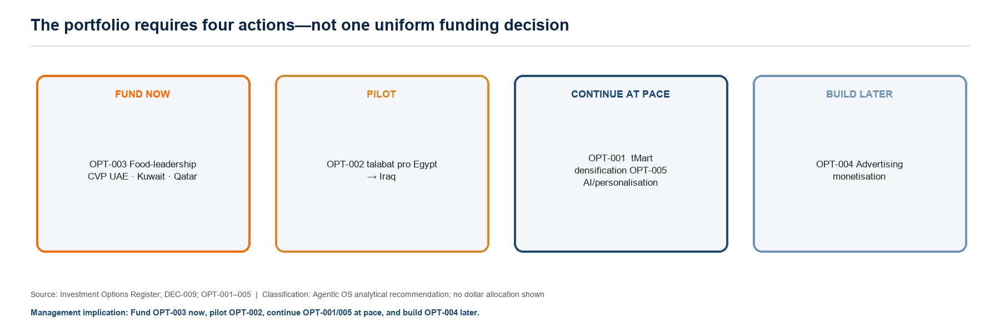
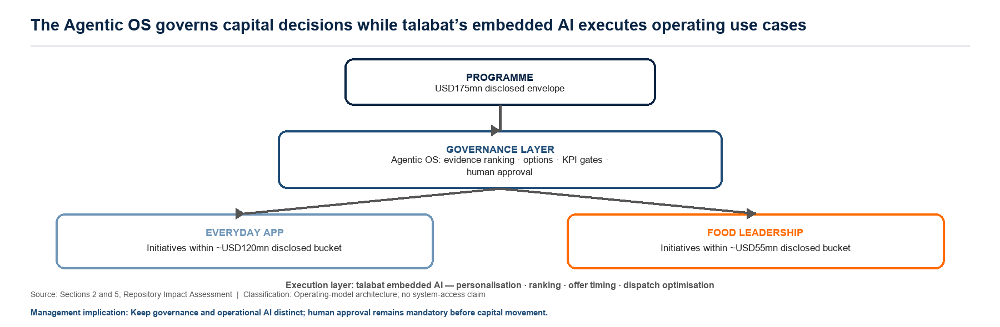
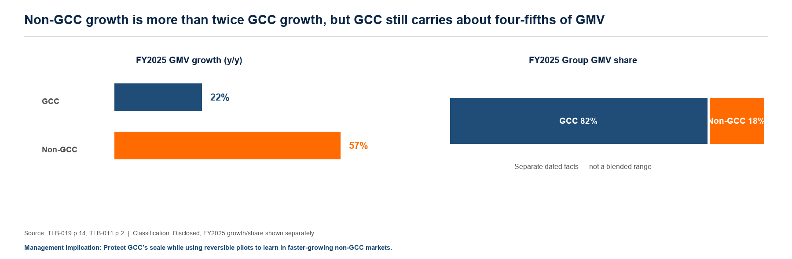
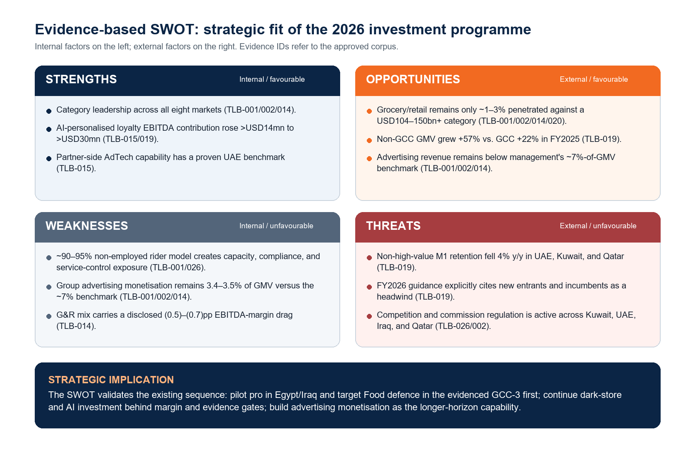
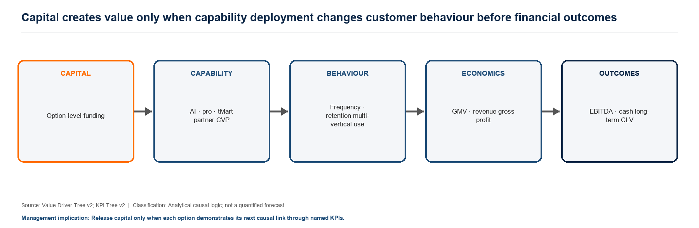
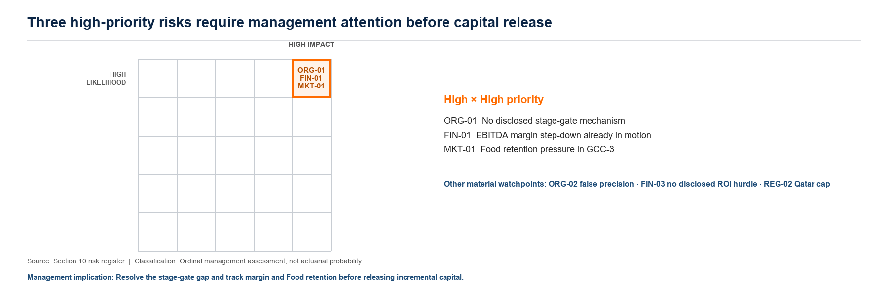
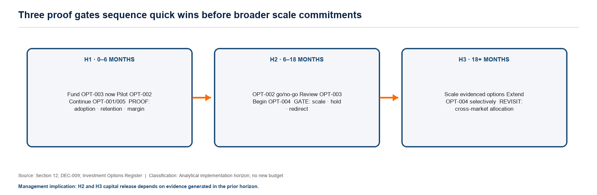
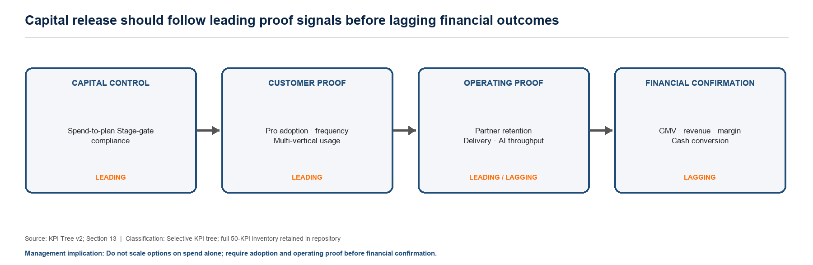

# talabat Group AI-Enabled Investment Allocation — Version 1.2

**Decision horizon:** 2026 investment programme  
**Programme boundary:** USD 175 million, comprising approximately USD 120 million for Everyday App initiatives and approximately USD 55 million for Food-leadership initiatives  
**Audience:** MBA faculty, senior executives, and Board-level readers

How to allocate and govern the 2026 USD175 million programme across Everyday App and Food-leadership initiatives to maximize profitable growth and long-term platform economics.

| Programme | AASTMT MBA · AI for Business Organizations |
|---|---|
| Team | Group G02 |
| Scope | talabat Group · eight operating markets |
| Decision horizon | 2026 investment programme |
| Document status | Version 1.2 remediated manuscript · independently verified baseline · 25 July 2026 |

Recommendation in one line Protect Food leadership in the evidenced GCC-3 markets, pilot talabat pro in Egypt then Iraq, continue proven Everyday App investments, and release funding through human-approved KPI gates.

#### Contents

| 1 | Executive Summary |
|---|---|
| 2 | Business Description |
| 3 | Market Analysis |
| 4 | Value Proposition |
| 5 | AI Technology and Development |
| 6 | Business Model and Revenue Streams |
| 7 | Marketing and Sales Strategy |
| 8 | Operations Plan |
| 9 | Financial Plan |
| 10 | Risk Analysis |
| 11 | Corporate Social Responsibility & Responsible AI |
| 12 | Implementation Plan |
| 13 | Monitoring and Evaluation |
| 14 | Appendices |

Evidence convention: disclosed facts are cited by TLB source/page or vault note; assumptions and forecasts retain ASM/node identifiers; analytical allocations developed using the Agentic OS are explicitly labeled analytical.

## 1. Executive Summary

The completed evidence-based SWOT in Section 3 §3.3 validates, rather than changes, the approved funding sequence: its opportunity/threat pairs support near-term `OPT-002`/`OPT-003`, its proven-capability strengths support continuing `OPT-005`, and its margin and geographic-transfer weaknesses preserve the existing gates on `OPT-001`/`OPT-004`.

Exhibit 1. Approximately 69% of the disclosed 2026 programme is directed to Everyday App expansion.

Exhibit 2. The portfolio requires four actions—not one uniform funding decision.

### Situation

talabat Holding plc is a publicly listed, Group-wide on-demand delivery platform (Dubai Financial Market, IPO priced 29 November 2024) operating across eight markets — UAE, Kuwait, Qatar, Bahrain, Oman, Jordan, Iraq, and Egypt (Group; the governing problem charter). FY2025 results show a large, growing, and newly profitable business at scale: GMV of USD 9.5 billion (+28% cFX), revenue of USD 3.9 billion, Adjusted EBITDA of USD 615 million (6.5% margin), and 7.5 million active customers (Group; the governing problem charter). Management itself frames the company's strategic trajectory as a deliberate transition "from a multi-vertical food-delivery platform to the region's Everyday App" (Group; TLB-020, page 16, cited in Section 2 §2.1) — the strategic intent this business plan's recommendation operates inside, not one it invents. For 2026, the Board approved a USD 175 million investment programme, split by talabat's own disclosure into an Everyday App bucket (~USD 120 million: talabat mart dark-store densification, talabat pro loyalty scaling, new verticals) and a Food-leadership bucket (~USD 55 million: consumer value proposition, partner retention, targeted incentives), fully funded from internal cash (Group; the supporting evidence register; TLB-020, page 16).

### Complication

The public disclosures reviewed do not identify — and this project cannot observe — how that USD 175 million should be allocated within each bucket, across eight markets that differ sharply in maturity, profitability, and competitive intensity. The evidence assembled across this business plan shows real dispersion of return, not a uniform growth story. Group Adjusted EBITDA margin compressed to 4.8% of GMV in Q1 2026 — down from 6.3% a year earlier and from 6.0% in Q4 2025 — a real, already-realized step-down, not a hypothetical risk (Group; the governing problem charter; Section 10 §10.3, FIN-01). Food-leadership's non-high-value customer retention has already eroded 4% year-on-year in three of talabat's most mature markets — UAE, Kuwait, and Qatar specifically (market-comparison; TLB-019, page 9; Section 3). Grocery & retail — the fastest-growing vertical and the largest named Everyday App line item — remains penetrated at only 1-3% of a USD 104-150 billion+ addressable category (Group/external; Section 3 §3.1). And the public disclosures reviewed do not identify any internal capital-allocation committee, approval threshold, or stage-gate process for this or any programme (Group; the supporting evidence register; Section 8 §8.4) — meaning a USD 175 million programme is currently being spent with no disclosed mechanism to redirect it if early evidence diverges from plan. Left undifferentiated, this programme risks funding what is already familiar rather than what the disclosed evidence actually supports.

### Question

How should talabat allocate its 2026 USD 175 million investment programme across Everyday App and Food-leadership initiatives — and within them, across markets and initiative categories — to maximise profitable growth, customer lifetime value, customer retention, and long-term platform economics, given the evidence actually available, and without pretending to possess internal customer-level data this project does not have? (the governing problem charter)

### Answer

This business plan's answer is a framework and a committed sequence, not a single number. talabat does not need a new capital-allocation process invented from scratch — it needs the evidence-ranked, stage-gated discipline applied to the process it has already disclosed and already funded. This business plan's governing hypothesis (Section 2 §2.3) — that applying such a framework to the already-approved USD 175 million envelope will raise its realized GMV, EBITDA, and customer-lifetime-value contribution relative to an unranked allocation — is supported, not merely asserted, by every section that follows it: five evidence-grounded candidate initiatives were identified, compared on an explicit 11-criterion basis, and ranked (talabat mart densification-AI/personalisation capability, the approved funding-sequence decision, approved 2026-07-23, middle path).

### Business Name and Overview

talabat Holding plc — a mature, profitable, publicly listed Group operating a three-sided marketplace (customers, restaurant/retail Partners, riders) across eight countries, generating GMV of USD 9.5 billion in FY2025 across food delivery, grocery and quick-commerce (talabat mart), and a growing set of adjacent services (subscription, advertising, FinTech) (Group; Section 2 §2.1).

### Mission and Vision

talabat's own stated trajectory — moving "from a multi-vertical food-delivery platform to the region's Everyday App," a framing management itself calls "a deliberate strategic choice, made from a position of strength" (Group; TLB-020, page 16) — is the mission and vision this business plan's recommendation is built to serve, not a new one this business plan proposes. This business plan's own contribution sits one layer below that mission: making sure the USD 175 million funding that mission for 2026 is spent against explicit evidence and criteria, not left undifferentiated.

### AI Product/Service, Target Market, and Value Proposition

The AI product is not customer-facing — it is an AI-enabled decision-support system that assembles talabat disclosed evidence, ranks candidate investment initiatives against explicit, documented criteria, builds range-bound (never single-point) financial scenarios, and monitors a KPI and stage-gate framework, gated for human approval before any capital moves (the governing problem charter; Section 2 §2.4-2.5; Section 5 §5.1). The target market is internal: talabat's own 2026 capital-allocation decision, applied across its eight operating markets, with Egypt as this business plan's richest single-country worked example, not its boundary. The value proposition is comparative in kind, not degree: talabat disclosed rationale for the programme is qualitative ("investments rather than costs... expected to offset the margin impact over time," TLB-020, page 16), with no internal capital-allocation methodology disclosed anywhere in the public disclosures reviewed — this business plan's USP is a transparent, evidence-traceable allocation framework where every recommended dollar resolves to a named Fact, Decision, or labeled Assumption, against that undisclosed status quo (Section 4 §4.1). The customer-facing capability the 2026 programme itself scales — AI-driven personalisation, offer timing, and dispatch optimisation — is already built, licensed from parent Delivery Hero SE, and generating a disclosed, growing EBITDA contribution (>USD 14 million FY2024 → >USD 30 million FY2025); this business plan does not need to build it, only to help allocate capital toward scaling it where the evidence is strongest (Section 5 §5.1-5.2).

### Key Objectives, Growth Goals, and Financial/Funding Summary

Objective: raise the realized GMV, EBITDA, and customer-lifetime-value contribution of the already-approved USD 175 million programme by replacing undifferentiated spend with an evidence-ranked, stage-gated sequence, without requesting incremental capital beyond what talabat has already committed (Section 2 §2.3; Section 9 §9.6). Growth goals: talabat disclosed FY2026 guidance — GMV +11-14% cFX, revenue +14-17% cFX — stated here as the Group base case this business plan adopts, not a target this business plan sets independently (Section 9 §9.3). Financial and funding summary: the USD 175 million programme (~USD 120 million Everyday App, ~USD 55 million Food-leadership) is fully funded from internal cash; this business plan requests no incremental capital and constructs no return figure beyond talabat disclosed FY2026 Adjusted EBITDA guidance of 4.4-4.8% of GMV and free cash flow guidance of 3.2-3.6% of GMV. Consistent with the approved funding-sequence decision's mandatory placement rule, no dollar range for any individual candidate initiative appears in this summary or anywhere else in this business plan as a headline commitment — the five initiatives' illustrative cost ranges exist only as a labeled sensitivity exhibit in Section 14, each carrying the sentence "This is an Agentic OS analytical recommendation, not a disclosed talabat allocation" (Section 14 §14.3).

## 2. Business Description

Exhibit 3. The Agentic OS governs capital decisions while talabat’s embedded AI executes operating use cases.

talabat does not need to invent a new capital-allocation process — its Board has already approved and disclosed one: a USD175 million 2026 investment programme split into an Everyday App bucket (~USD120 million) and a Food-leadership bucket (~USD55 million), funded entirely from internal cash and framed explicitly as "investments rather than costs" (TLB-020, page 16). What the public disclosures reviewed do not identify is how that programme is being allocated below the bucket level — across specific initiatives, across its eight operating markets, or against a stated evidence-and-return framework. This business plan's governing hypothesis is that applying a disciplined, evidence-ranked, stage-gated allocation and monitoring framework to this already-approved envelope — rather than treating it as a single undifferentiated spend line — will raise the realized GMV, EBITDA, and customer-lifetime-value contribution of the programme relative to an unranked allocation, because the programme's own disclosed structure already separates a quantified cost (the FY2026 Adjusted EBITDA margin bridge) from an entirely undisclosed return, and because the candidate initiatives within it show materially different evidence strength, scalability, and reversibility profiles that an unranked allocation would not distinguish.

### 2.1 Industry Overview and Opportunities for AI Adoption

talabat operates a three-sided marketplace across eight countries (UAE, Kuwait, Qatar, Bahrain, Oman, Jordan, Iraq, Egypt — the supporting evidence register), generating GMV of USD 7,428mn in FY2024 (+23% YoY) across food delivery, grocery and quick-commerce (talabat mart), and a growing set of adjacent services (subscription, advertising, FinTech) (the supporting evidence register; the supporting evidence register). Since its Dubai Financial Market listing (November 2024, TLB-025) management has repeatedly framed the company's strategic trajectory as a transition "from a multi-vertical food-delivery platform to the region's Everyday App" (TLB-020, page 16) — a framing management itself calls "a deliberate strategic choice, made from a position of strength." The 2026 investment programme is the financial expression of that choice: a Board-approved, internally-funded USD175 million commitment, first disclosed February 2026 (TLB-019) and fully decomposed by May 2026 (TLB-020, TLB-014) into ~USD120mn for Everyday App capability-building (talabat mart densification, talabat pro scaling, new verticals) and ~USD55mn for defending Food-leadership against "both new entrants and incumbents" (the supporting evidence register).

### 2.2 Problem Statement (MECE)

The business problem this business plan addresses decomposes into four mutually exclusive, collectively exhaustive sub-problems, each corresponding to a genuine, separately-evidenced gap in what talabat discloses:

- Cross-bucket allocation (already resolved by talabat, not this business plan's decision). The USD175mn

- Within-bucket, cross-initiative allocation (open — this business plan's primary contribution). Neither

### 2.3 Governing Hypothesis

We believe that applying an AI-enabled, evidence-ranked, stage-gated allocation and monitoring framework to talabat disclosed USD175 million 2026 investment programme — rather than leaving its within-bucket and cross-market allocation undifferentiated — will raise the programme's realized GMV, EBITDA, and customer-lifetime-value contribution, because (a) the programme's own disclosure already separates a quantified cost (the FY2026 Adjusted EBITDA margin bridge, 4.4-4.8% of GMV guided) from an entirely undisclosed return, meaning no evidence currently exists to confirm the programme is being spent optimally even on its own terms, and (b) the five identified candidate initiatives show materially different confidence, scalability, and reversibility profiles (the approved funding-sequence decision's 11-criterion comparison) that an unranked, undifferentiated allocation would not distinguish or act on.

### 2.4 Core Features and Benefits

The proposed AI-enabled decision-support system's core features, each already evidenced by a real artifact this analysis produced, not a hypothetical capability:

- Evidence assembly and geography discipline — every claim tagged Group/GCC/non-GCC/Egypt-standalone/

- Investment Option comparison — a structured, 11-criterion, High/Medium/Low comparison framework

### 2.5 Business Model

The AI-enabled decision-support system is proposed as an internal capability, not a licensed or externally-sold product — consistent with talabat disclosed pattern of embedding AI/ML capability across functions rather than treating it as a discrete product line. talabat's own AI/ML capability is itself inherited from parent Delivery Hero SE's shared technology stack rather than built standalone (the supporting evidence register; the supporting evidence register) — this business plan's proposed decision-support layer follows the same embedded-capability pattern, not the same build-vs-partner arrangement (see Section 5.2 for that distinction). the supporting evidence register N-06 notes AI/personalisation is "not named as a discrete dollar line within either bucket... an embedded capability." Consistent with that pattern, the capital-allocation decision-support layer proposed here is structured the same way: embedded into how the USD175mn programme (and any future programme like it) gets planned, monitored, and adjusted — not a standalone software product with its own revenue line. This is a deliberate, evidenced framing choice, not an oversight: Section 6 (Business Model and Revenue Streams) accordingly does not need to construct a new revenue stream for "the AI system" itself; its value is realized entirely through the better-allocated USD175mn it supports.

### 2.6 Current Business Stage

The underlying business (talabat) is public, mature, and profitable at Group level (IPO November 2024; FY2025 Adjusted EBITDA margin ~6.5% of GMV) — not a startup. The specific capability this business plan proposes — an evidence-ranked, stage-gated capital-allocation framework applied to the 2026 investment programme — is at an early, pilot-appropriate stage: five candidate initiatives have been identified and ranked (the approved funding-sequence decision), but zero have yet moved past status: candidate to approved or scaled, and the cross-market allocation question (problem 3 in §2.2) remains open pending better evidence than the public corpus alone provides. This is the correct, honest stage to be at for a plan whose own charter states that "exact optimal allocations cannot be proven from public data alone" (the governing problem charter) — Section 12 proposes exactly this staged approach (pilot before scale, evidence-gated transitions) rather than a premature full-scale rollout recommendation.

## 3. Market Analysis

Exhibit 4. Non-GCC growth is more than twice GCC growth, but GCC still carries about four-fifths of GMV.

talabat's own disclosures show a company that already dominates the categories it operates in by category-share multiple, yet has penetrated only a fraction of the underlying addressable demand — and the 2026 investment programme's existing shape already reflects that gap more than it reflects the scale advantage. Reconciling top-down category penetration against talabat's own realized bottom-up scale shows the largest unrealized headroom sits in grocery/retail (penetrated at low single digits of a USD 104–150bn+ addressable category) and in the faster-growing but still-minority non-GCC segment (+57% GMV growth y/y against GCC's +22% in FY2025, non-GCC rising from 18% of Group GMV in FY2025 to 21% of Group GMV by Q1 2026 — two dated data points, not a blended range) — precisely the two areas the ~USD 120mn Everyday App bucket is weighted toward. At the same time, talabat's own evidence shows category leadership alone has already failed to prevent a measured retention decline among non-high-value customers in three of its most mature markets, which is the direct, disclosed rationale for the ~USD 55mn Food-leadership bucket. Three of this business plan's five ranked candidate Investment Options (talabat mart densification, Food-leadership action, advertising capability) map onto opportunity/threat pairs this section identifies directly; this section's genuinely open gaps — Egypt's inconsistent category-share figure, the absence of any Egypt-specific named competitor in the primary corpus, and the GCC-3-market scope of the Food-leadership competitive-pressure evidence — are stated explicitly below rather than smoothed over, consistent with the governing problem charter's own evidence-limitations standard.

### 3.1 Industry Trends — Market Sizing, Top-Down and Bottom-Up, Reconciled

Reframing note. The GSB template's Section 3 asks for "AI market size and growth projections" and "AI adoption trends... in the MENA region." Consistent with Section 2's framing (the AI-enabled capability this business plan proposes is a capital-allocation decision-support layer, not a customer-facing product with its own addressable market), the market that matters for this decision is the market the USD 175mn programme actually operates in — talabat's own eight-country delivery, grocery, and retail marketplace — not a standalone "MENA AI market" figure. No AI-market-size or AI-adoption-by-sector TAM figure exists anywhere in the 29-document primary corpus; constructing one would require exactly the kind of fresh external research Part A's Stage 5 leaves open (the supporting evidence register). This section does not fabricate one — it sizes talabat's actual operating market instead, which is the evidence the public disclosures reviewed actually supports and the market the investment decision is about.

### 3.2 Target Market — MECE Segmentation

Primary segmentation axis: talabat disclosed reportable-segment geography — GCC / non-GCC (Jordan + Iraq) / Egypt (standalone from FY2025). This is MECE because every dollar of Group revenue and gross profit sits in exactly one of these three IFRS 8 reportable segments, per talabat's own disclosure structure — no market is counted twice, and none falls outside the three (the supporting evidence register; the supporting evidence register).

- Growth-signal figures: market-comparison; TLB-019, page 14; TLB-010.)* GCC's dominance is

### 3.3 Competitive Analysis

#### SWOT — with a "so what" per quadrant

The four SWOT quadrants (internal/external × favourable/unfavourable) are MECE by construction; each is populated only with disclosed evidence, and each carries an explicit conclusion, not an orphan observation.

**Strengths**

- **Category leadership across all eight markets.** talabat holds a 1x+–10x+ category-share multiple versus the next-closest peer (TLB-001, page 5; TLB-002, page 5; TLB-014, page 4). **So What?** Existing scale lowers the strategic need for undifferentiated share-buying and supports investment in deeper loyalty, multi-vertical use, and monetization instead.
- **Proven AI-personalised loyalty economics.** The disclosed estimated EBITDA contribution from AI-driven recommendations rose from more than USD 14mn in FY2024 to more than USD 30mn in FY2025 (TLB-015, page 21; TLB-019, page 11). **So What?** `OPT-005` should continue at pace because it extends an evidenced capability rather than funding an unproven build.
- **A functioning Partner-side AdTech benchmark.** UAE talabat mart demonstrates an 8% CPG advertising-investment ratio versus a typical 2% industry benchmark (TLB-015, page 108). **So What?** The capability is proven in one market, but geographic transfer remains to be demonstrated before `OPT-004` scales Group-wide.

**Weaknesses**

- **Fulfilment depends on a largely non-employed rider base.** Approximately 90–95% of riders are third-party-logistics or freelance, a model talabat identifies as a labour-compliance and service-quality-control exposure (TLB-001, pages 34 and 47; TLB-026, pages 131 and 138). **So What?** Any volume-led option must pass a fulfilment-capacity and service-quality gate rather than treating delivery capacity as unconstrained.
- **Group advertising monetization remains below management's benchmark.** Advertising revenue is 3.4–3.5% of GMV against management's approximately 7%-of-GMV medium-term benchmark (TLB-001, page 21; TLB-002, pages 10, 14, and 19; TLB-014, page 19). **So What?** The gap supports `OPT-004`, but its single-market proof and capability-build requirement keep it in the longer-horizon position.
- **Grocery and Retail growth carries weaker near-term economics.** The product-mix shift carries a disclosed (0.5)–(0.7) percentage-point Adjusted EBITDA margin drag (TLB-014, pages 6 and 8). **So What?** `OPT-001` should continue only behind the existing margin-drag checkpoint, not be accelerated solely because G&R grows faster.

**Opportunities**

- **Large grocery/retail headroom.** Online penetration is only approximately 1–3% against a disclosed USD 104–150bn+ addressable category (TLB-001, page 21; TLB-002, page 8; TLB-014, pages 5 and 19; TLB-020, page 16). **So What?** The headroom validates continued `OPT-001` investment, subject to the margin gate identified above.
- **Faster growth outside the mature GCC base.** Non-GCC GMV grew 57% year on year versus GCC growth of 22% in FY2025, while non-GCC represented 18% of Group GMV in FY2025 and 21% by Q1 2026—two dated data points, not a blended range (TLB-019, page 14; TLB-011, page 2). **So What?** The growth premium supports a reversible `OPT-002` pilot in Egypt and Iraq, not an unsupported full-scale transfer of GCC evidence.
- **Uncaptured advertising monetization.** The same gap between the Group's 3.4–3.5% advertising-revenue ratio and management's approximately 7% benchmark is a monetization opportunity (TLB-001, page 21; TLB-002, pages 10, 14, and 19; TLB-014, page 19). **So What?** `OPT-004` remains strategically attractive but appropriately sequenced after near-term retention and pilot actions.

**Threats**

- **Measured retention erosion in the GCC-3.** Non-high-value customer M1 retention fell 4% year on year in UAE, Kuwait, and Qatar specifically (TLB-019, page 9). **So What?** This is direct evidence for near-term `OPT-003` Food-leadership action in those three markets, not a Group-wide generalization.
- **A more competitive operating environment.** FY2026 guidance explicitly identifies new entrants and incumbents as a headwind (TLB-019, page 18). **So What?** Capital release should be tied to customer and partner proof signals rather than assuming historical category leadership will defend itself.
- **Active competition and commission regulation.** The corpus records competition-law or commission interventions in Kuwait, UAE, Iraq, and Qatar (TLB-026, pages 46–47; TLB-002, page 9). **So What?** `OPT-003` and any commission-economics action must retain market-specific legal gates and cannot use an uncapped GCC-average assumption.

Exhibit 5. The evidence-based SWOT validates the existing investment sequence and specifies the gates attached to each option.

**Recommendation re-evaluation.** The SWOT does not change the approved investment ranking. It independently validates `DEC-009`: `OPT-002` and `OPT-003` remain the near-term priority; `OPT-001` and `OPT-005` continue at pace behind their existing evidence and margin gates; and `OPT-004` remains the longer-horizon capability build. No new assumption or financial value is required to reach that conclusion.

#### Competitor benchmarking

### 3.4 Opportunities

The opportunity set below is the expanded view of Section 3 §3.3's evidence-based SWOT Opportunity quadrant; it preserves the same evidence boundaries and option mappings.

Untapped markets / underserved categories. Grocery/retail is the clearest untapped-opportunity category in the public disclosures reviewed: only ~1–3% penetrated of a USD 104–150bn+ addressable category (§3.1), and the vertical growing fastest by GMV (+47% y/y FY2025) despite carrying a structurally lower take rate/margin than Food — an explicit, disclosed (0.5)–(0.7)pp Adjusted EBITDA margin drag from the product-mix shift (the supporting evidence register; TLB-014, page 6). This is a genuine growth-versus-margin trade-off this business plan engages with directly (consistent with talabat mart densification's framing) rather than presenting grocery GMV growth as equivalent in value to Food GMV growth. Non-GCC (+57% y/y GMV growth in FY2025, still only 18% of Group GMV that year, rising to 21% by Q1 2026 — TLB-019, p.14; TLB-011, p.2, two dated data points presented separately, not blended) is the second clear underserved-market opportunity by the same logic — a genuinely higher-growth segment that remains structurally under-penetrated relative to its GCC counterpart's maturity (2023 monthly orders per capita: GCC 1.28x vs. non-GCC 0.13x, a ~10x gap, TLB-026, page 121; the supporting evidence register).

## 4. Value Proposition

Section 3 §3.3 provides the competitive test of this value proposition: the strengths and opportunities map to the Value Driver Tree, while the weaknesses and threats define the conditions under which those drivers may not convert into financial outcomes.

Exhibit 6. Capital creates value only when capability deployment changes customer behaviour before financial outcomes.

The value this business plan creates does not come from a single new capability — it comes from applying a disciplined ranking-and-monitoring layer to five value mechanisms talabat has already proven, at Group/GCC scale, but has not yet evidenced as deliberately sequenced against its 2026 investment programme. Multi-vertical engagement (13.0x vs. 3.8x order frequency between multi-vertical and food-only customers), talabat pro (20-28% frequency uplift, 26-32% retention uplift), targeted incentives (Rewards +15%, PostPaid +14%), and AI/personalisation (embedded, not a separate budget line) are each independently evidenced value drivers — this section's contribution is showing how they trace, one by one, through the relevant analytical framework's chain to GMV, revenue, gross profit, and EBITDA, and where each one still lacks Egypt/non-GCC-specific proof.

### 4.1 Unique Selling Proposition (USP)

The USP is not a new customer-facing product — it is evidence-ranked, stage-gated capital allocation applied to an already-committed USD175mn programme. talabat disclosed rationale for the programme is qualitative ("investments rather than costs... expected to offset the margin impact over time," TLB-020, page 16); no competitor benchmark or internal capital-allocation methodology is disclosed anywhere in the public disclosures reviewed (the supporting evidence register). The USP is therefore comparative in kind, not degree: a transparent, evidence-traceable allocation framework where every recommended dollar amount resolves to a named Fact, Decision, or labeled Assumption — versus the undisclosed status quo. Argued narratively (per the approved financial-boundary decision, not as a quantified exhibit): the disclosed ~2.2:1 weighting toward Everyday App over Food-leadership is itself a real, evidenced management judgment (the supporting evidence register) — this business plan's initiative-level ranking (the approved funding-sequence decision) engages with, rather than second-guesses, that top-level weighting.

### 4.2 Value Creation Mechanisms — Each Quantified

Revenue lift — multi-vertical engagement. Multi-vertical customers show 13.0x order frequency vs. 3.8x for food-only customers (the supporting evidence register; the relevant analytical framework N-14), and multi-vertical GMV share has risen 68%→73%→76% across Dec'24→Dec'25→Mar'26 (the relevant analytical framework N-11). This is the single strongest quantified mechanism in the public disclosures reviewed and the direct evidence base for talabat mart densification (talabat mart densification, the primary lever for driving multi-vertical adoption).

### 4.3 Impact on Customer Outcomes and ROI — Calculation Logic Shown

Customer outcome, stated honestly: no absolute customer lifetime value figure is disclosed anywhere in the public disclosures reviewed (the supporting evidence register); the mechanisms above are evidenced as relative uplifts and GMV-share trends, not an absolute CLV number this section can cite. the supporting evidence register's clearest quantified customer-outcome proxy is the >4x gap in monthly spend between multi-vertical and food-only customers — this is the number this business plan uses to argue customer-level value creation, not an invented CLV figure.

## 5. AI Technology and Development

talabat does not need to build a new AI capability to execute this business plan's core recommendation — the customer-facing AI capability (recommendation ranking, offer timing, dispatch optimisation) it will scale via the 2026 investment programme is already built, licensed, and generating a disclosed, growing EBITDA contribution (>USD14mn FY2024 → >USD30mn FY2025). What this business plan adds is a second, distinct AI-enabled capability that talabat does not yet disclose having: a structured decision-support layer for ranking and monitoring how the investment programme itself gets allocated. This section describes both, keeps them clearly separate, and does not invent a budget figure for either that the public disclosures reviewed doesn't disclose.

### 5.1 Description of AI Technology

talabat's embedded AI (scaled by the investment programme): machine-learning-driven personalisation (item-level and cuisine-level recommendation ranking), offer/promotion timing (triggering talabat pro and Rewards offers), and logistics dispatch optimisation — described in the public disclosures reviewed as producing "AI-driven logistics improvements" credited with delivery-time and cost-efficiency gains (TLB-001, page 10) and personalisation credited with timing loyalty offers "at the right time for customers" (the supporting evidence register; the supporting evidence register).

### 5.2 Build / Buy / Partner Decision — Structured Options Analysis

talabat's embedded AI capability: already a partner arrangement — talabat's technology stack is licensed from Delivery Hero SE (the supporting evidence register), the parent company, giving talabat access to Group-level AI capability without a standalone build. The 2026 investment programme's Everyday App opex allocation (~USD75mn) funds scaling this existing capability (more markets, more inventory, deeper personalisation), not building a new one from scratch — the build/buy/partner decision for the underlying technology was effectively made before this programme existed, and this business plan does not propose revisiting it.

### 5.3 Proprietary Algorithms, Data Models

No proprietary algorithm or patent is disclosed anywhere in the public disclosures reviewed for talabat's embedded AI capability — it is described functionally (what it does: ranking, timing, dispatch), not architecturally (the supporting evidence register's Open Questions). This business plan's decision-support system is not a novel algorithm either — it is a structured evidence-ranking and citation-traceability process (the supporting evidence register's 11-criterion framework; the supporting evidence register's tagging discipline), not a proprietary model. Neither technology in scope here claims IP this business plan can quantify or protect.

### 5.4 Infrastructure and Tools

talabat's own infrastructure is not itemized in the public disclosures reviewed beyond the Delivery Hero licensing relationship. This business plan's decision-support system uses the analytical environment described in Appendix E, with the knowledge, decision, and forecast architecture described in Appendix E.

### 5.5 Scalability and Adaptability

talabat's embedded AI capability has already demonstrated multi-market scalability (live across 6 of 8 countries for talabat pro personalisation by end-2024, excluding Egypt and Iraq — TLB-012, TLB-013, TLB-015, TLB-016, TLB-026; the relevant analytical framework N-08/N-13) — the investment programme's opex allocation extends this further, not builds new scalability. This business plan's own decision-support system is currently scoped to five candidate Investment Options and, as of this drafting round, all 14 Business Plan sections — genuinely narrow relative to a future multi-programme or multi-year scope. Its adaptability is structural, not yet demonstrated at scale: the same Investment Option schema, 11-criterion comparison, and Geographic Evidence Rules discipline would extend to additional candidate initiatives or future investment programmes without a redesign, but this has not been tested against a larger option set.

### 5.6 Research and Development Plans

For talabat's embedded AI: the supporting evidence register names talabat's own stated Group roadmap items (evidenced intent) — this business plan does not add new customer-facing AI R&D beyond what talabat has already disclosed, since the programme's opex allocation is described as scaling, not inventing, capability. For this business plan's decision-support system: the two largest open R&D items are (1) resolving the cross-market allocation question (problem 3 in Section 2.2 — a disclosure gap in the public disclosures reviewed itself, distinct from the approved funding-sequence decision, which is already resolved and settles a different question: initiative-level funding sequence and allocation-range presentation within each bucket, problem 2) as better country-level evidence becomes available, and (2) instrumenting the KPI Tree's Governance family (currently 7/7 newly-instrumented KPIs with no baseline) so future allocation rounds can be evaluated against real performance data rather than constructed ranges alone.

| Claim | Source |
|---|---|
| AI-driven logistics improvements credited with delivery-time/cost gains | TLB-001, page 10 |
| talabat's stack licensed from Delivery Hero SE | the supporting evidence register |
| AI/personalisation EBITDA contribution USD14mn+→30mn+ | the supporting evidence register; the relevant analytical framework N-09 |
| N-06 not a discrete dollar line in either bucket | the relevant analytical framework N-06 |
| talabat pro live in 6/8 countries by end-2024 (excl. Egypt, Iraq) | TLB-012, TLB-013, TLB-015, TLB-016, TLB-026; the relevant analytical framework N-08/N-13 |

## 6. Business Model and Revenue Streams

talabat's revenue is not four independent product lines but a single GMV-times-blended-take-rate system (~38–41% of GMV across FY2024–2025) in which four disclosed fee-type components — commission fees, delivery & service fees, subscription fee & other income, and advertising & listing fees — respond to different underlying volume, penetration, or pricing drivers, and are MECE by construction of talabat's own Management Revenue reporting convention (every dollar of revenue is exactly one of the four, net of a fifth, contra-revenue "vouchers and other discounts" line). The capital-allocation-relevant finding is that the fastest-growing, most under-penetrated-relative-to-its-own-stated-benchmark lines — subscription (driven by talabat pro penetration) and advertising (driven by Partner demand for a customer base that must first be engaged) — are also the lines this business plan's ranked candidate options (talabat pro pilot talabat pro acceleration; advertising capability advertising monetization gap closure) are best positioned to move, while G&R's structurally lower take rate/margin (the reason talabat mart densification's talabat mart densification carries an explicit, disclosed EBITDA drag) means multi-vertical GMV growth is not uniformly as valuable per dollar as the headline GMV figure implies. At the per-customer level, the >4x monthly-spend gap between food-only (AED 194 / USD 53/month, 3.8 orders) and multi-vertical (AED 814 / USD 222/month, 12.8 orders) customers is the clearest disclosed unit-economics argument for this business plan's cross-sell-weighted allocation. One open reporting question — the "Subscription fee & Other Income" combined line's decomposition into a true subscription component and a tMart-dominated "other income" component (the approved analytical assumption/the approved decision record) — is carried forward exactly as already resolved, not re-litigated here.

### 6.1 Revenue Generation Methods — MECE Streams Traced to the Value Driver Tree

Why this is MECE. talabat's own "Management Revenue" reporting convention already decomposes total revenue into exactly four fee-type lines, net of one contra-revenue line — every disclosed revenue dollar belongs to exactly one of the five rows below, no overlap, no gap (Group; TLB-001, page 27; TLB-002, page 20):

| Stream | FY2024 | FY2025 | Growth | Primary driver | Value Driver Tree node(s) |
|---|---|---|---|---|---|
| Commission fees | USD 1,062mn | USD 1,297mn | +25% → +22% | Food-vertical order volume (agent-model marketplace transaction — talabat earns commission without owning inventory); rate under some disclosed downward pressure | N-05, N-10 (Food-leadership capability), N-14/N-16 (order frequency), N-26 (Food GMV) |
| Delivery & Service fees | USD 696mn | USD 859mn | +29% → +24% | Order count and basket composition; structurally eroded per-order by talabat pro's free-delivery-above-threshold benefit even as pro raises order frequency | N-08 (pro adoption), N-14/N-16 |
| Subscription fee & Other Income (combined line — see decomposition below) | USD 952mn | USD 1,397mn | +44% → +47% | talabat pro subscriber-penetration (GMV share 32%→49%, Q1 2025→Q1 2026) plus tMart's near-95%-take-rate owned-inventory "other income" component | N-07 (G&R product-mix shift), N-08, N-20/N-21/N-22 (retention/CLV uplift) |
| Advertising & listing fees | USD 246mn | USD 323mn | +27% → +32% | Partner demand for visibility — a lagging function of how engaged/frequently-ordering the customer base is, not an independent driver | N-09 (AI/personalisation), N-29, N-11/N-17 (multi-vertical usage), advertising capability |
| less: Vouchers and other discounts (contra-revenue) | — | USD (120)mn | — | Funded promotional/incentive spend | N-12 (targeted incentives) |

### 6.2 Pricing Strategy

talabat's pricing is not one strategy but four distinct pricing mechanisms, one per revenue stream, each priced differently and each subject to a different constraint:

- Commission (agent-model, negotiated/rate-set) — talabat sets a commission rate on Food and Local

- Delivery & service fees (usage-based) — priced per order/basket, with talabat pro's free-delivery

### 6.3 Recurring vs. One-Time Revenue Streams

Reframing note, consistent with Sections 2/3's own precedent. The template's language ("subscription fees, licensing, service contracts, custom AI solutions") describes a SaaS/professional-services revenue mix that does not map cleanly onto talabat disclosed marketplace model — the public disclosures reviewed do not identify any "one-time" revenue line in the traditional sense (no license sale, no setup fee, no custom-project contract). This section states that mismatch explicitly rather than forcing an artificial "one-time" category the public disclosures reviewed does not support. The MECE distinction talabat's own disclosure actually supports is:

- Contractually recurring: subscription fees only (talabat pro membership) — the smallest of the four

- Recurring-with-usage (repeats every transaction, no contractual lock-in): commission fees, delivery

### 6.4 Unit Economics — What One Customer and One Order Earn and Cost

Per-customer, per-month (the clearest disclosed unit-economics differentiator in the public disclosures reviewed). Food-only customers spent AED 194 (≈ USD 53)/month at 3.8 orders, while multi-vertical (Food + G&R) customers spent AED 814 (≈ USD 222)/month at 12.8 orders — a >4x monthly-spend gap tied to a ~3.4x order-frequency gap (Group, September 2024 basis; TLB-026, pages 91, 122). This is the single strongest per-customer economic argument in the public disclosures reviewed for this business plan's cross-sell-weighted allocation (talabat mart densification, talabat pro pilot) over an allocation that treats every incremental order the same regardless of vertical mix — a customer who becomes multi-vertical is worth roughly four times as much per month, not a marginal increment.

### 6.5 The Proposed AI Decision-Support Layer's Own Revenue Treatment (cross-reference)

Consistent with Section 2.5's framing: the AI-enabled capital-allocation decision-support system this business plan proposes is an internal capability, not a separately-sold product, and therefore does not add a new revenue line to the MECE breakdown above. Its value is realized entirely through the four existing streams' better allocation — specifically, by helping direct capital toward the mechanisms (talabat pro pilot talabat pro; advertising capability advertising) shown above to sit closest to the under-penetrated, fastest-growing lines, rather than by monetizing the decision-support layer itself. This is a deliberate scope choice carried forward from Section 2, not a gap in this section's own analysis.

## 7. Marketing and Sales Strategy

talabat disclosed marketing posture is not price-led acquisition but customer-value-proposition (CVP) investment — management states explicitly that Food-leadership capital goes toward CVP "rather than matching competitor discounts and vouchers" (Group; TLB-020, page 16) — and this business plan's marketing and sales strategy for the 2026 investment programme adopts that same positioning by design, not by default: acquisition and retention spend should be concentrated on the evidenced, product-embedded mechanisms already ranked in the supporting evidence register (talabat pro, multi-vertical cross-sell, Rewards, PostPaid, Family Plan) rather than broad vouchering, and should be sequenced across markets the way talabat itself already sequenced FinTech (GCC-first, Egypt as the first disclosed non-GCC follow-on) rather than assumed uniform across all eight markets at once. The genuine, unresolved gap this section must handle openly is that no funnel-stage conversion data (awareness → trial → subscription) exists anywhere in the public disclosures reviewed at any geography level — the customer-journey sequence (Food → Grocery & Retail → talabat pro sign-up) is real, disclosed evidence, but the percentage of customers who move between those stages is not disclosed anywhere; this section states that gap plainly and requires the pilot to measure each conversion stage before it informs a funding decision. Partnerships and retention tactics both draw on the same ranked mechanism set: talabat pro, Rewards, PostPaid, and the co-branded bank cards, positioned as product-embedded loyalty investment, with talabat pro pilot (talabat pro acceleration in Egypt/Iraq) and Food-leadership action (Food-leadership CVP targeted at UAE/ Kuwait/Qatar) as this business plan's own ranked, evidence-grounded candidates for where marketing/sales-adjacent capital should go first.

### 7.1 Positioning — What talabat Is, and Deliberately Is Not, Competing On

The stated positioning. talabat frames itself as transitioning "from a multi-vertical food-delivery platform to the region's Everyday App" (Group; TLB-020, page 16, cited in Section 2 §2.1), a narrative arc management itself traces across three successive brand statements — "Delivering food to your doorstep" (2016) → "Delivering food and a lot more" (2021) → "It's not just talabat app, it's your app" (2025) (Group; TLB-016, page 7; the supporting evidence register). Against a competitive backdrop management itself names as intensifying — "a more competitive environment (new entrants and incumbents)" is a stated FY2026 headwind (Group; TLB-019, page 18; the supporting evidence register), with non-high-value customer M1 retention having declined 4% year-over-year specifically in UAE, Kuwait, and Qatar (market-comparison: UAE, Kuwait, Qatar; TLB-019, page 9) — talabat's own stated response is not to match on price.

### 7.2 Customer Acquisition — Channels, Funnel, and Journey Mapping

Disclosed channels (Fact, Group level). The corpus discloses acquisition and retention spend by cost category, not by discrete marketing channel (no disclosed breakdown of paid search, social, in-app referral, or offline spend exists anywhere in the public disclosures reviewed). What is disclosed: total Customer Acquisition and Retention Costs (CARC) rose from USD 89mn (1.5% of GMV, 2023) to USD 155mn (1.6% of GMV, 2025), of which USD 89mn (2025) was talabat-funded vouchering specifically (Group; TLB-001, page 28; TLB-002, page 21; the supporting evidence register); separately, Partner-funded savings (not a talabat marketing-spend line, but a channel-adjacent customer-facing incentive) reached an all-time-high 7% of GMV in Q1 2026, totaling more than AED 1,567.7mn over a trailing 12-month period (Group; TLB-020, page 7; TLB-023, page 6). So what for the P&L: because talabat's own cost taxonomy already separates "vouchering" (a discount cost) from the CARC total, this business plan's acquisition strategy inherits that same discipline — proposing that any 2026-programme acquisition spend be tracked and evaluated the same way, as an investment with a measurable frequency/retention return, not merely a discount cost (the supporting evidence register Business Implications).

| Funnel stage | Disclosed baseline | Measurement requirement | Decision use |
|---|---|---|---|
| Awareness → App download / first visit | Not disclosed | Measure during the pilot | Establish acquisition baseline before funding decisions |
| Download → Trial (first order placed) | Not disclosed | Measure during the pilot | Assess first-order conversion |
| Trial → Reaches ~6-order personalisation threshold | Mechanical threshold disclosed; conversion rate not disclosed (TLB-002, p.15) | Measure during the pilot | Assess progression to personalisation eligibility |
| 6-order threshold → Multi-vertical adoption (Food + G&R) | Journey disclosed; conversion rate not disclosed (TLB-013, p.6) | Measure during the pilot | Assess multi-vertical adoption |
| Multi-vertical → talabat pro sign-up | Journey disclosed; conversion rate not disclosed (TLB-013, p.6) | Measure during the pilot | Assess subscription conversion |

### 7.3 Partnerships

Restaurant/retail Partners — the disclosed core of the partnership base. Food-leadership's stated partner-side investment is explicit: "on the partner side, we invest in retaining, winning back, and acquiring high-demand food partners... reflected in commission rate investments" (Group; TLB-020, page 16; TLB-014, page 19; the supporting evidence register) — a qualitative mechanism with no disclosed partner-retention percentage or count anywhere in the public disclosures reviewed (the supporting evidence register N-10). This is directly relevant to marketing/sales strategy because Partner economics fund a meaningful share of customer-facing promotional value: Partner-funded savings reached an all-time-high 7% of GMV in Q1 2026 (Group; TLB-020, page 7) — distinct from, and larger in scale than, talabat's own voucher spend.

### 7.4 Retention — Support, Community, and Product Enhancement

The ranked mechanism set, restated for the sales-and-marketing lens. the supporting evidence register's own synthesis ranks five product-embedded retention levers by strength of corpus evidence: (1) talabat pro — a 20-28% order-frequency uplift and 26-32% retention uplift versus matched non-subscribers, and a 136% gross-profit-per-customer uplift in the 30 days following subscription (GCC + Jordan, six markets live before December 2024; explicitly excludes Egypt and Iraq by name; TLB-001, page 18; TLB-015, pages 78, 104; TLB-019, page 11); (2) multi-vertical engagement, which amplifies pro's effect rather than operating independently — mono-vertical subscribers show a +16pp M1 retention lift versus mono-vertical non-subscribers, multi-vertical subscribers show +20pp (GCC + Jordan; TLB-019, page 10); (3) talabat Rewards, an 18%-adoption, >15%-order-frequency-uplift-within-30-days mechanism that talabat's own language links directly to "reducing churn" (Group; TLB-026, page 134; TLB-015, page 79); (4) talabat PostPaid, a 14% order-frequency-increase-post-adoption mechanism described as "accretive to order frequency and customer retention" (Group; TLB-001, pages 9, 18); (5) Family Plan, a >60% retention premium over solo-plan subscribers, on the narrowest evidence base of the five (single document, single household-size segment, no adoption-rate or country breakout) (Group; TLB-018, page 6).

### 7.5 Where This Positions the Plan's Own Ranked Options

Restated plainly: this section's positioning (CVP over discounting), acquisition approach (product- embedded journey stages plus a pilot-measurement framework, sequenced on the disclosed GCC-first-then- Egypt FinTech precedent), partnership base (restaurant/retail Partners, banking co-brand cards), and retention tactic ranking (pro > multi-vertical > Rewards/PostPaid > Family Plan, AI as infrastructure) are not new claims invented for this section — they are the marketing-and-sales-strategy expression of the same evidence base the approved funding-sequence decision already used to rank talabat mart densification–AI/personalisation capability. Specifically: talabat pro pilot (pro acceleration, Egypt/Iraq) and Food-leadership action (Food-leadership CVP, UAE/Kuwait/Qatar) are this section's two most directly relevant candidates — the approved funding-sequence decision's resolved funding-sequence recommendation (not merely its earlier, purely descriptive 11-criterion tiering) names both jointly as the near-term priority pair, precisely because their profiles are complementary: talabat pro pilot is the higher-uncertainty, highest-reversibility candidate this section's own Egypt-first-then-Iraq sequencing (§7.2) is built around, best suited to a bounded pilot; Food-leadership action, by contrast, is an already-evidenced, already-operating mechanism that the approved funding-sequence decision and Food-leadership action's own option record recommend funding now, as a targeted budget weighting within the existing Food-leadership bucket — explicitly "not a pilot." Section 12's Three Horizons framing places both in Horizon 1 on this basis (one piloted, one funded directly), not because every near-term option must be piloted before scaling.

## 8. Operations Plan

talabat does not need to build new operational infrastructure to execute this business plan's recommendation — its technology and delivery infrastructure is already licensed and operating at Group scale through a disclosed set of inter-company services agreements with parent Delivery Hero SE (the Global Licensing and Services Agreement and its category-specific variants), and its logistics/dispatch stack already runs across all eight markets. What this business plan's own 7S alignment check finds is a genuine, honestly-named organizational gap, not an infrastructure one: talabat disclosed operating model is strong on Strategy (the Everyday App/Food-leadership split and the CVP-over-discounting positioning are clear and consistently communicated) and Style (a recognisable, repeated investor-communication cadence), adequate but concentrated on Structure and Staff (governance and named executive roles are visible but centred on Delivery Hero SE-overlapping seats, with two unexplained recent leadership transitions), and not ready on Systems — no internal capital-allocation committee, approval threshold, or stage-gate process for this specific USD175mn programme is disclosed anywhere in the 29-document corpus (the supporting evidence register) — and shows a real Skills gap, since no named data-science, capital-allocation, or portfolio-management function appears in the executive roster this corpus discloses. This section names those misalignments honestly and proposes closing the Systems gap with a stage-gate mechanism the Agentic OS explicitly labels as its own recommendation, gated for human approval, not a description of how talabat actually runs its own capital-allocation process today.

### 8.1 Infrastructure Needs

The technology layer is inherited, not built. talabat's underlying infrastructure runs on capability licensed from Delivery Hero SE rather than owned or engineered standalone by talabat itself, delivered through a disclosed Global Licensing and Services Agreement (GLSA): members of the Group in Bahrain, Egypt, Iraq, Oman, Jordan, and Qatar receive a defined "Central Value Basket" of data-management and communication tools, logistics tools (including rider-recruitment tools), customer-management tools, audit tools, quick-commerce tools (catalogue and assortment intelligence, purchase-management tools, supplier portal, inventory-management tools, store management, rider-management tools, advertising and promotion tools), FinTech tools (wallets, payment and fraud-protection solutions), and business-management services spanning sales/operations and international marketing, including "customer loyalty and subscription" support (market-comparison: Bahrain, Egypt, Iraq, Oman, Jordan, Qatar; TLB-026, pages 152-153) — with parallel, separately-named GLSA agreements covering UAE and Kuwait specifically (implied by the public disclosures reviewed's reference to "the GLSA, the GLSA Kuwait and the GLSA UAE" as distinct instruments; TLB-026, page 156). talabat pays Delivery Hero arm's-length compensation for this basket, calculated per specific service line (TLB-026, page 153). So what: this is the concrete evidence base for Section 5.2's build/buy/partner finding — the "partner" arrangement is not a general description, it is a named, priced, multi-market services contract that already covers most of what talabat mart densification through AI/personalisation capability would draw on operationally (inventory-management tools for talabat mart densification; loyalty/subscription support for talabat pro pilot; advertising/promotion tools for advertising capability; the shared data layer for AI/personalisation capability).

### 8.2 Development and Maintenance Workflow

What is disclosed: a contractual services structure, not an internal software development lifecycle. No document in the public disclosures reviewed describes talabat's internal engineering process (sprint cadence, release process, environment/staging structure, or code-ownership model) — this is a genuine gap, stated openly rather than invented. What is disclosed is how the underlying capability is provided and paid for: the GLSA (§8.1) sets the terms on which Delivery Hero supplies and talabat "localises and uses" the Central Value Baskets (Group/market-comparison; TLB-026, pages 152-153), the CQCA set equivalent terms for tMart-specific tools through 31 December 2024, since when the same tools are delivered via GLSA sub-licensing instead (Group; TLB-026, page 156), and a further Kitchens Services Agreement (effective 1 January 2022, amended 29 October 2024) covers the Kitchens business specifically in the UAE, Bahrain, Kuwait, Qatar, and Jordan (market-comparison: UAE, Bahrain, Kuwait, Qatar, Jordan; TLB-026, page 156). All three are governed by German law, with disputes resolved in German courts (GLSA: TLB-026, page 153; CQCA and Kitchens Services Agreement: TLB-026, page 156) — a detail worth naming because it confirms these are formal, arm's-length inter-company contracts, not an informal shared-services arrangement. So what: "maintenance" of talabat's core technology, for the purposes of this programme, is contractual and inter-company, not a talabat-internal release cycle this business plan can describe or optimise directly — any recommendation this business plan makes about accelerating a technology-dependent option (e.g. talabat mart densification's inventory tooling, AI/personalisation capability's model tuning) implicitly depends on Delivery Hero's own service delivery under these agreements, a dependency this business plan names rather than assumes away.

### 8.3 Key Team Roles and the Skills Gap vs. Today

Named roles the public disclosures reviewed discloses that this programme would plausibly draw on. talabat's executive roster includes several roles directly relevant to executing and governing this programme: Khaled Alfakesh, Chief Financial Officer since 2016, the most visible existing sponsor for a capital-allocation discipline function; Pedram Assadi, Chief Operations Officer; Wassim Makarem, SVP Grocery & Retail, described as "at the forefront of driving talabat's regional quick commerce initiatives" — the natural existing owner for talabat mart densification; Stefano Vecchio, VP People & Strategy, who also oversees "New Ventures" including talabat's loyalty programmes — the natural existing owner for talabat pro pilot; and a governance- adjacent cluster — Mohamd Abu Amara (Head of Governance, Risk & Compliance), Oussama El Kadri (Head of Internal Audit), and Abdullah AlGhrawi (VP Legal, GRC & Board Secretary, the DFM buyback notice signatory) (Group; the supporting evidence register, TLB-001, TLB-021).

### 8.4 7S Alignment Check

The corpus does not contain a pre-built 7S analysis for talabat — this is genuine synthesis, built here for the first time against the evidence assembled above and in the Topic Notes cited throughout this business plan. Each "S" is rated Ready, Partially ready, or Not ready, with the specific evidence and gap-closing action named — no unsupported rating.

| S | Rating | Evidence | Gap-closing action |
|---|---|---|---|
| Strategy | Ready | The Everyday App (~USD120mn) / Food-leadership (~USD55mn) split and the CVP-over-discounting positioning are clearly disclosed and consistently communicated (Section 2 §2.1; Section 7 §7.1; TLB-020, page 16) | None required — this is this business plan's strongest evidenced "S" |
| Structure | Partially ready | Board dominated by Delivery Hero SE officers (Vandepitte/Chair also DH SE COO; Krause also DH SE General Counsel; Popp also DH SE interim CFO — the supporting evidence register, TLB-026); Egypt operates through two dedicated legal entities (Delivery Hero Egypt SAE, Delivery Hero Dmart Egypt LLC) with no disclosed local board or decision rights (the supporting evidence register Open Questions) | This business plan's recommendation is presented for Group-level approval, consistent with the visible governance concentration, rather than assuming a country-level approval path exists (the supporting evidence register Strategic Implications) |
| Systems | Not ready — the largest gap | No internal capital-allocation committee, approval threshold, or stage-gate process for the USD175mn programme is disclosed anywhere in the public disclosures reviewed (the supporting evidence register) | This business plan's proposed mechanism, developed using Agentic OS analysis, not a description of talabat's actual process: a lightweight stage-gate — each OPT- option reviewed against its own named stage gate (already specified per option, e.g. talabat pro pilot's 2-quarter Egypt pilot checkpoint, talabat mart densification's margin-drag checkpoint) before scale-up funding, tracked against the relevant analytical framework's Governance family (G1-G7, all seven newly-instrumented, none with a corpus baseline) — gated for human/team approval before any capital moves, per the Responsible-AI principle Section 11 develops further |
| Shared Values | Partially evidenced | Management's own stated framing — "these are investments rather than costs" (TLB-020, page 16) and CVP-over-discounting (TLB-020, page 16) — is a real, quotable value statement; no equivalent explicit value statement about AI ethics or data governance is disclosed beyond the DTA's compliance mechanics (§8.5) | This business plan's Section 11 (Responsible AI) is the designated place to state the value the Agentic OS itself operates on (human-approval-gated recommendations, never a false-precision automatic decision) explicitly, since talabat's own disclosure does not state an equivalent value for its internal allocation process |
| Skills | Not ready | No named data-science, capital-allocation, or portfolio-management function in the disclosed executive roster (§8.3); advertising capability/AI/personalisation capability both name a specific, currently-unconfirmed capability gap (Partner-facing ad sales; per-market AI model tuning) | Locate the proposed Systems function (above) near the existing CFO/GRC structure rather than inventing a new seat; pilot AI/personalisation capability's per-market model-tuning gap in Egypt specifically, per AI/personalisation capability's own pilot recommendation |
| Style | Ready | A recognisable, repeated communication cadence — Capital Markets Day for medium-term targets, Annual Report for the year's strategic objective, quarterly results for dollar figures (the supporting evidence register "venue pattern") — and consistent language ("investments not costs," CVP-over-discounting) across TLB-014/019/020 | None required |
| Staff | Partially ready | Governance-adjacent named roles exist (GRC, Internal Audit, Legal/Board Secretary — §8.3) — but two leadership transitions are recorded in the public disclosures reviewed without any narrated explanation: CEO Tomaso Rodriguez → Toon Gyssels (between TLB-018, Aug 2025, and TLB-009, Feb 2026) and board seat Muhammad Hussain Ghati Al Jbori → Abdul Wahab Al-Halabi (between TLB-004/TLB-026 and TLB-008) (the supporting evidence register, the supporting evidence register) | Named explicitly here as a continuity caveat and carried forward into Section 10 (Risk Analysis) as an organizational risk, not resolved or explained by this business plan, since no source in the public disclosures reviewed does so either |

### 8.5 Security and Compliance Measures

A disclosed security incident, not a hypothetical risk. In December 2022, talabat was hacked by an external attacker based in Norway, who gained access to the personal data of 144,469 customers in one of talabat's markets (market unnamed in the disclosure); talabat informed the competent data-protection regulator, which opened an investigation, and talabat paid a USD 150,000 penalty (Group, specific market not disclosed; TLB-026, page 49). The same risk-factor disclosure states plainly that because talabat's technology infrastructure — including payment solutions and data storage — depends on Delivery Hero's systems, talabat is "vulnerable to any security breaches or data protection issues that may occur at the parent company level" (Group; TLB-026, page 49) — a direct, disclosed consequence of the same partner/licensed-infrastructure model described in §8.1.

## 9. Financial Plan

The SWOT does not alter any financial assumption or disclosed value. It reinforces the existing capital-release logic: grocery/retail headroom supports `OPT-001`, but the disclosed G&R margin drag requires the N-32/F8 checkpoint; the AdTech gap supports `OPT-004`, but only as a staged capability build.

talabat's own FY2026 guidance already prices in the 2026 investment programme's cost: GMV growth of 11-14% cFX, Revenue growth 14-17% cFX, Adjusted EBITDA of 4.4-4.8% of GMV (down from 6.0% in Q4 2025), and Free Cash Flow of 3.2-3.6% of GMV. This business plan's financial case does not construct a separate, more precise projection than talabat's own guidance — per the approved financial-boundary decision, it presents that guidance as the headline base case, with upside and downside scenarios bounding it, and explicitly does not attempt to isolate a return figure for either investment bucket, because no such figure is disclosed anywhere in the public disclosures reviewed.

### 9.1 Value Driver Tree — Linking the Investment Programme to Financial Outcomes

The governing chain (the supporting evidence register; formalized as the relevant analytical framework's 45 nodes): Investment → capability deployment → adoption/operational change → customer/partner behaviour → order frequency → multi-vertical usage → basket/AOV → retention/CLV → GMV → revenue → gross profit → EBITDA → cash flow. Every node from "customer/partner behaviour" onward that connects the programme to a financial outcome is an Assumption node, not a Fact node — the public disclosures reviewed discloses the programme's cost (the EBITDA margin bridge) but not a quantified return at any point in this chain (the relevant analytical framework, "Central evidence-gap this tree does not paper over").

### 9.2 Initial Investment and Operational Costs

Disclosed, not decided by this business plan: USD175mn total, Board-approved February 2026, fully funded by internal cash — ~USD120mn Everyday App (~USD75mn opex + ~USD45mn capex) + ~USD55mn Food-leadership (the supporting evidence register). This business plan's own analytical sub-allocation (talabat mart densification–005, ranged in the Portfolio Register, ranked and sequenced in the approved funding-sequence decision, status: approved 2026-07-23 — middle path) is referenced here narratively, not shown as a headline financial exhibit, per the approved funding-sequence decision's own mandatory placement rule (the constructed dollar ranges belong in a Section 14 appendix/sensitivity exhibit, each carrying the sentence "This is an Agentic OS analytical recommendation, not a disclosed talabat allocation," never here): the five options span both buckets plus two cross-cutting enabling-capability candidates, are explicitly non-additive against the USD175mn total, and do not claim to allocate 100% of either bucket (the supporting evidence register's stated caveats). Recommended funding sequence (per the approved funding-sequence decision): run talabat pro pilot as a bounded talabat pro pilot in Egypt, extending to Iraq only if the evidence supports it, and fund Food-leadership action now as the evidenced Food-leadership action in UAE, Kuwait, and Qatar; talabat mart densification (dark-store densification) and AI/personalisation capability (AI/personalisation) continue at pace; advertising capability (advertising gap) is a longer-horizon build.

### 9.3 Revenue Forecasts — Base, Upside, Downside (FY2026)

| Scenario | GMV growth (cFX) | Revenue growth (cFX) | Adj. EBITDA margin | FCF margin | Basis |
|---|---|---|---|---|---|
| Base | 11-14% | 14-17% | 4.4-4.8% of GMV | 3.2-3.6% of GMV | talabat disclosed FY2026 guidance (TLB-020, TLB-014) |
| Upside | Toward/above 14% | Toward/above 17% | Toward 4.8%+ | Toward/above 3.6% | Everyday App/Food-leadership mechanisms (multi-vertical, pro, advertising) compound faster than guidance embeds — the supporting evidence register upside case |
| Downside | Toward/below 11% | Toward/below 14% | Toward/below 4.4% (Q1 2026 actual already 4.8%, -9% y/y in absolute EBITDA dollars) | Toward/below 3.2% | Margin compression deepens, behaviour-change trends moderate faster than guidance assumes — the supporting evidence register downside case |

All three rows are Group-level, per the approved financial-boundary decision. No bucket-level, market-level, or initiative-level breakout of these figures is shown here — none is disclosed, and constructing one would be exactly the false-precision error the approved financial-boundary decision was escalated to prevent.

### 9.4 Break-Even Analysis and P&L Snapshot — What Can and Cannot Be Shown

A conventional break-even/payback analysis requires a return figure to compare against the USD175mn outlay. No such figure exists in the public disclosures reviewed for either bucket or any candidate initiative — confirmed independently by the relevant analytical framework, the supporting evidence register, the supporting evidence register. What can be shown honestly: the disclosed cost side, as a P&L snapshot — Adjusted EBITDA margin moving from 6.0% (Q4 2025 actual) to a realized 4.8% (Q1 2026 actual) to a 4.4-4.8% guided range (FY2026), a temporary, deliberate step-down management itself frames as investment, not deterioration (TLB-020, page 16). This business plan does not construct a break-even date or payback period this evidence cannot support.

### 9.5 Key Assumptions Register (the numbers this case depends on)

All fourteen listed are status: Approved in the supporting evidence register (resolved 2026-07-23, alongside the approved funding-sequence decision) — citable as settled inputs per the register's own rule. Listed here for transparency, exactly as the pipeline requires:

### 9.6 Funding Requirements, Allocation, and Monetization Strategy

Funding requirement: none beyond what talabat has already committed — the USD175mn programme is fully funded from internal cash (TLB-020, page 16); this business plan does not request incremental capital beyond the disclosed envelope. Allocation: governed by the disclosed ~120mn:55mn bucket split (fixed) and, within it, the five candidate options this business plan has ranked and sequenced per the approved funding-sequence decision (approved 2026-07-23, middle path): talabat pro pilot and Food-leadership action as near-term priority, talabat mart densification and AI/personalisation capability continuing at pace, advertising capability as the longer-horizon build — stated narratively as this business plan's actual recommendation; the underlying the approved analytical assumption dollar ranges are never a headline figure here, and appear only in Section 14's labeled sensitivity exhibit. Monetization: not applicable in the conventional sense — this is a capital-allocation decision-support exercise, not a revenue-generating product; its "monetization" is the incremental GMV/EBITDA the better-allocated USD175mn is expected to generate relative to an unranked baseline, a claim this section deliberately does not quantify, per §9.1's evidence-gap finding.

## 10. Risk Analysis

The SWOT is connected to the risk register rather than maintained as a parallel narrative: rider dependency maps to `MKT-02`, retention erosion to `MKT-01`, advertising under-monetization to `MKT-03`, G&R margin drag to `FIN-04`, and active competition/commission regulation to `REG-01`/`REG-02`.

Exhibit 7. Three high-priority risks require management attention before capital release.

This business plan's largest risk is not algorithmic — it is that talabat is funding a margin-dilutive, evidence-thin capital-allocation programme with almost no disclosed internal mechanism to correct course, layered on top of already-realized competitive, regulatory, and leadership volatility. Of the 17 material risks identified below across five MECE categories (Technical, Market, Financial, Organizational & Governance, Regulatory), three land in the probability-impact matrix's highest-severity quadrant (High probability × High impact): the absence of any disclosed internal stage-gate or approval mechanism for the USD175mn programme (ORG-01), the already-observed FY2026 Adjusted EBITDA margin step-down (FIN-01), and competitive pressure eroding Food's non-high-value customer base faster than its ~USD55mn defense budget (MKT-01). A fourth category-defining risk — the possibility that the Agentic OS's own constructed allocation ranges get mistaken for a disclosed talabat commitment (ORG-02) — is unique to this business plan's own recommendation process, not a risk talabat's disclosures describe, and is named here explicitly because the approved financial-boundary decision and the approved funding-sequence decision were each escalated specifically to guard against it. Every risk below carries a named owner and a mitigation grounded in already-disclosed evidence or this business plan's own prior pipeline output (Section 8's proposed stage-gate mechanism, the Governance KPI family, the approved financial-boundary decision/ the approved funding-sequence decision's disclosure discipline) — each is evidence-specific. This risk list is the direct evidentiary anchor Section 11 (CSR & Responsible AI) must operationalize, particularly ORG-01, ORG-02, and ORG-03.

### 10.1 Technical Risks

This breakdown is MECE by proximate cause, not by every downstream effect: each risk is assigned to exactly one category based on the mechanism through which it first materializes, with secondary effects in other categories cross-referenced inline rather than double-counted in the matrix (§10.6) or the risk total.

### 10.2 Market Risks

MKT-01 — Competitive pressure is already eroding Food's non-high-value customer retention faster than its capital allocation defends against it. The disclosed non-high-value M1 retention decline is -4% y/y, scoped specifically to UAE, Kuwait, and Qatar (market-comparison: UAE, Kuwait, Qatar; TLB-019, p.9) — Food-leadership's ~USD55mn CVP/partner-retention investment is funded to counter exactly this pressure (the supporting evidence register), yet Food still represents the majority of Group GMV (USD6.65bn vs. G&R's USD2.77bn, FY2025; Group; TLB-002, p.18) against under a third of the 2026 programme's total capital — a genuine, the supporting evidence register's own Business Implications names rather than resolves. Whether Egypt or other non-GCC markets face comparable pressure is not evidenced anywhere in the public disclosures reviewed (the supporting evidence register Open Questions) — extending this risk beyond UAE/Kuwait/Qatar is a labeled inference, not a disclosed fact. Geography: market-comparison (UAE, Kuwait, Qatar) for the retention-decline evidence; Group for the GMV/funding comparison; inferred-applicability if extended to Egypt/non-GCC.

### 10.3 Financial Risks

FIN-01 — The disclosed FY2026 Adjusted EBITDA margin step-down is real, evidenced, and already in motion, with a documented trail — not a hypothetical risk. Group Adjusted EBITDA margin fell from 6.7% (FY2024) to 6.5% (FY2025); FY2026 guidance steps this down further to 4.4-4.8% of GMV, a deliberate choice funding the USD175mn programme, not a surprise (Group; TLB-020; the supporting evidence register). Q1 2026 actual Adjusted EBITDA margin was already 4.8%, at the guided range's low end, with Adjusted EBITDA down 9% year-on-year and Net Income down 18% year-on-year even as GMV and Revenue grew (Group; TLB-020, pp.4, 10-11). the governing problem charter separately frames the same Q1 2026 4.8% actual figure against the prior-year quarter specifically ("compressed to 4.8% from 6.3% a year earlier," Group; the governing problem charter) — a different, non-contradictory comparator (year-on-year vs. this section's quarter-on-quarter framing above) for the same underlying print. the supporting evidence register's downside case extrapolates this trend deepening beyond guidance's low end if the G&R margin drag (FIN-04 below) or the Everyday App/Food-leadership margin bridge's own unreconciled quarterly-vs-annual attribution prove larger than currently guided. Geography: Group.

### 10.4 Organizational & Governance Risks

ORG-01 — No internal capital-allocation committee, approval threshold, or stage-gate process is disclosed anywhere in the public disclosures reviewed. This is the single largest, load-bearing governance gap this business plan works around: the supporting evidence register states plainly that no document describes how a specific initiative (country-level or category-level) moves from proposal to funded line item, or how — or whether — the Board could reallocate the USD175mn programme intra-year if early results diverge from plan. Section 8's 7S alignment check independently confirms Systems as talabat's least organizationally-ready dimension for exactly this reason. Without a disclosed correction mechanism, capital could keep flowing to an underperforming option (e.g., talabat mart densification if its margin-drag trajectory worsens, per FIN-04) with no committed trigger to stop it. Geography: Group.

### 10.5 Regulatory Risks

REG-01 — Antitrust/competition-law exposure tied directly to talabat's market dominance. Ongoing Kuwait Competition Protection Authority investigations/litigation over Partner dealings, UAE Competition and Consumer Protection Department notices over Partner-subscription contract clauses, and an Iraq competition-authority inquiry (no formal complaint) are each disclosed (country-specific: Kuwait, UAE, Iraq; TLB-001, pp.32,34; TLB-002, p.26; TLB-026, pp.46-47), per the supporting evidence register. The corpus's own language — "antitrust scrutiny... related to talabat's strong market position" (TLB-001, p.34) — makes the causal link explicit: dominance itself invited this exposure. Geography: country-specific (Kuwait; UAE; Iraq — three separately disclosed items, not a single multi-country claim).

### 10.6 Probability-Impact Matrix

New synthesis, built fresh against the evidence assembled above — not a pre-existing corpus artifact. Probability and Impact are each rated High/Medium/Low based on: Probability — whether the risk is already observed/realized in the public disclosures reviewed (High), a plausible extension of an observed trend or named but unresolved exposure (Medium), or a low-likelihood/narrow-scope item (Low); Impact — the risk's potential effect on the USD175mn programme's ability to deliver its stated exit criterion (TLB-020's "more loyal customer base") at Group scale (High), at a bucket/option level (Medium), or narrowly scoped to one option/market (Low).

### 10.7 Pre-Mortem: "It is FY2028, and the 2026 investment programme failed to deliver a more loyal

customer base — why?"

- **The governance gap never closed, and this business plan's own numbers were mistaken for commitments

- **Margin compression deepened past the point of return, and no one could tell which line was responsible

### 10.8 Mitigation Strategy and Owners (per material risk)

Owners are drawn from talabat disclosed executive roster (the supporting evidence register) where a function plausibly exists; where no such function is named — a gap this business plan states explicitly rather than inventing a role — the nearest disclosed function is named as interim owner, consistent with Section 8 §8.3's own treatment of the same gap.

## 11. Corporate Social Responsibility & Responsible AI

This business plan treats Responsible AI as risk management, not decoration, because it has to: the recommendation process analysed through the Agentic OS creates a real risk (ORG-02, the false-precision risk the approved financial-boundary decision and the approved funding-sequence decision were each escalated to guard against), sits inside an organization with no disclosed correction mechanism for its own capital-allocation programme (ORG-01), and depends on leadership continuity that has already shown two unexplained transitions (ORG-03). Every commitment in this section is a concrete, already- operating control tied by name to one of these three Section 10 risks, not a generic AI-ethics statement: (1) this business plan's constructed numbers are never shown as if internally verified — a control already exercised twice in practice, not just asserted, at the approved financial-boundary decision (Section 9's headline case restricted to talabat disclosed base-case guidance) and the approved funding-sequence decision (the five investment options' cost ranges confined to a labeled sensitivity exhibit, never a headline commitment); (2) every geography-crossing inference is explicitly labeled, the supporting evidence register, preventing the specific bias failure mode (misapplying GCC- measured evidence to Egypt as if disclosed there) this pivot's own root-cause analysis identified; and (3) no capital-allocation recommendation this business plan makes is presented as an automatic management decision — the supporting evidence register's Owner section and Section 8 §8.4's proposed stage-gate mechanism both require human/team approval before any capital actually moves, directly operationalizing the governing problem charter's own Responsible-AI principle. Sustainability initiatives (§11.2) are real and disclosed — EV delivery pilots in Egypt and the UAE, Group-level emissions reporting, rider training and compensation, and named community programmes — but this section is honest that no disclosed link exists between them and the USD175mn programme this business plan is about, and states that gap rather than implying one.

### 11.1 Ethical AI Commitments Tied to Concrete Controls

This breakdown is MECE by control type, not by ethical principle in the abstract: each commitment names exactly one operating control, the Section 10 risk (or, for Control 4, the stakeholder expectation) it answers, and the evidence that the control already works in practice, not just in policy language.

| Commitment | Concrete control | Section 10 risk / stakeholder expectation | Evidence the control is real, not aspirational |
|---|---|---|---|
| No false-precision capital numbers | Headline-exhibit restriction + mandatory disclosure sentence on every constructed range | ORG-02 | the approved financial-boundary decision (Option 1, approved); the approved funding-sequence decision (middle path, approved) |
| Geography-crossing inferences always labeled | Nine-tag geography system; checked at citation audit (13.9) and Geographic Evidence Gate (Stage 16) | Fairness/evidentiary-integrity risk this pivot's own root-cause analysis identified | the supporting evidence register; the superseded the relevant analytical framework case study |
| No customer-level data claim | Aggregate-only inputs (Group/GCC/segment) | Stakeholder expectation (Board/investor trust, post-TECH-02/REG-04) | the governing problem charter; Section 8 §8.5 |
| No assumed-uniform AI effectiveness across markets | AI/personalisation capability per-market model-tuning pilot, Egypt first | TECH-01 | Section 8 §8.4; Section 10 §10.8 |

### 11.2 Sustainability Initiatives

talabat discloses real, if partial, sustainability activity — this business plan reports it honestly, including what it does not know. Four categories of disclosed activity exist in the primary corpus:

- Electric-vehicle delivery fleet. talabat operates 240 electric vehicles in the UAE (as of January

- Group-level emissions reporting. talabat reports total 2025 emissions of 875,157 tCO2e (Scope 1:

### 11.3 Commitment to Responsible AI Practices and Governance Structures

The governing principle, stated at charter level and never diluted downstream. the governing problem charter states: "The AI does not claim to possess talabat's internal, customer-level data, and its output is not a substitute for management decision-making... every allocation recommendation in the resulting plan is a range or a staged-funding proposal grounded in disclosed evidence and explicitly labeled assumptions, gated for human approval before any capital actually moves, never a false-precision single number presented as if it were internally verified." the supporting evidence register's Owner section restates this operationally: "This register is owned by the Decision Steward Agent, with capital-allocation recommendations ultimately requiring human/team approval before being presented as a Business Plan recommendation." This section is where that principle becomes a named governance structure this business plan commits to, tied explicitly to ORG-01 and ORG-03.

### 11.4 What this section does not claim

Consistent with the discipline the rest of this business plan applies, this section states three things it explicitly does not do: (1) it does not claim talabat has adopted, or has committed to adopt, any of the governance structures proposed above — they are this business plan's recommendation, informed by Agentic OS analysis, pending human/team decision, exactly as Section 8 §8.4 the supporting evidence register state; (2) it does not claim the sustainability initiatives in §11.2 are funded by, or governed under, the USD175mn 2026 investment programme — no such linkage is disclosed; (3) it does not claim to have resolved ORG-01 or ORG-03 — both remain open risks in Section 10's probability-impact matrix even after this section's proposed mitigations, because a proposed mechanism, not yet adopted, does not retire a risk that depends on adoption.

## 12. Implementation Plan

The Three Horizons sequence implements the SWOT implication directly: Horizon 1 prioritizes the reversible pro pilot and evidenced GCC-3 Food response; later releases keep dark-store, AI, and advertising actions behind the existing evidence, margin, and market-transfer gates.

Exhibit 8. Three proof gates sequence quick wins before broader scale commitments.

The five candidate Investment Options this business plan has identified do not all belong at the same starting point. the approved funding-sequence decision's underlying 11-criterion comparison groups talabat mart densification (talabat mart densification) and AI/personalisation capability (AI/personalisation scaling) as the strongest-evidence, broadest-applicability pair — continue-at-pace items requiring no new pilot. But the approved funding-sequence decision's resolved funding-sequence recommendation is not a simple restatement of that evidence tiering: it names talabat pro pilot (talabat pro acceleration, Egypt/Iraq) and Food-leadership action (Food-leadership CVP targeting, UAE/Kuwait/Qatar) as the near-term priority pair, precisely because their profiles are complementary — talabat pro pilot is the cheapest, most reversible option and the best-suited to genuine piloting given its weaker (GCC-inferred) evidence base, while Food-leadership action is an already-evidenced, already-operating mechanism (the approved analytical assumption's inference problem does not apply to it) that the approved funding-sequence decision and its own option record both recommend funding immediately, not gating behind a pilot. advertising capability (advertising monetization) is the longer-horizon build. This business plan's Three Horizons sequencing implements that resolved recommendation directly, not an assumed Egypt-first default or a re-derivation of the evidence tiering alone.

### Three Horizons Roadmap

#### Horizon 1 (0-6 months) — Fund the near-term priority pair, continue Tier 1 at pace

- Continue at pace: talabat mart densification (talabat mart densification) and AI/personalisation capability (AI/personalisation

- Pilot: talabat pro pilot (talabat pro acceleration in Egypt and Iraq) — the approved funding-sequence decision names this the

- Fund now, within the existing bucket: Food-leadership action (Food-leadership, UAE/Kuwait/Qatar) — per

#### Horizon 2 (6-18 months) — Evidence-gated decisions on the piloted/continuing items

#### Horizon 3 (18+ months) — Scale what H1/H2 evidenced, revisit the cross-market gap

### Dependencies and Timelines

H2 decisions are explicitly gated on H1 evidence, not calendar time alone — per the KPI Tree's Governance family (the relevant analytical framework), none of which currently has a baseline. The single largest dependency across all three horizons is the same one flagged in Section 2.2: no market-level allocation logic is disclosed anywhere in the public disclosures reviewed, so every horizon's country-specific decision (Egypt/Iraq for talabat pro pilot, UAE/Kuwait/Qatar for Food-leadership action) is this business plan's own proposed evidence-gate structure, not a validated talabat process.

### Marketing Rollout Plan

Not primarily applicable to this business plan's actual product (an internal capital-allocation decision-support system, per Section 5) — the "rollout" that matters is internal: to the extent H1's talabat pro pilot pilot involves customer-facing changes (accelerated pro marketing in Egypt/Iraq), that rollout should follow the same evidence-gated logic as the funding decision itself, not run ahead of it.

### Team Expansion and Recruitment Goals

Not disclosed anywhere in the public disclosures reviewed for either the underlying AI capability or a capital-allocation function (the supporting evidence register's governance-mechanics gap extends here) — this business plan does not invent a headcount figure. The genuine, evidenced need is process, not headcount: an owner for the KPI Tree's Governance family and the the approved funding-sequence decision/future-decision escalation path, a role this business plan assigns functionally (Decision Steward) rather than as a proposed new hire.

## 13. Monitoring and Evaluation

SWOT dependencies are monitored through existing KPI families, not a new scorecard: customer KPIs test loyalty and retention, operational KPIs test fulfilment capacity, financial KPIs test monetization and margin conversion, and governance KPIs control stage-gated release and reallocation.

Exhibit 9. Capital release should follow leading proof signals before lagging financial outcomes.

This business plan's monitoring framework does not invent new metrics to look complete — it reproduces the relevant analytical framework's 50 KPIs across five families (Portfolio, Customer & growth, Financial, Operational, Governance) faithfully, states plainly which 30 already have a talabat-disclosed baseline and which 20 do not, and assigns no numeric target to any newly-instrumented KPI without a Decision Log entry to back it. The single most important finding this section carries forward: the entire Governance family (7 KPIs) has zero baseline, because talabat discloses zero internal capital-allocation governance mechanics anywhere in the 29-document corpus — any stage-gate or reallocation-threshold KPI this business plan proposes is explicitly its own recommended mechanism.

### KPIs Mapped to the Value Driver Tree

Full 50-KPI detail, leading/lagging tags, and geography tags: the relevant analytical framework.

### Leading vs. Lagging Split

Every KPI in the relevant analytical framework carries this tag explicitly. The pattern that matters most for this business plan's own decision logic: Portfolio and Operational KPIs are predominantly leading (spend pacing, dark-store density predict downstream GMV effect before it shows up in Financial KPIs); Financial KPIs are predominantly lagging (EBITDA margin confirms what already happened); Governance KPIs are a distinct third category — process-compliance indicators that are neither predictive of nor confirmatory about financial outcome, but are the precondition for the other two families being trustworthy inputs to a future allocation decision.

### Churn — the Single Biggest Customer-Side Gap

No churn rate, definition, or cohort analysis exists anywhere in the public disclosures reviewed, for talabat overall (Group) or for Egypt specifically (the supporting evidence register) — the only country the public disclosures reviewed addresses this question for at all. This is carried forward from the pre-pivot problem's own finding, unchanged by the pivot — it becomes a metric this programme must start measuring from zero, not one it improves against a known baseline. Any churn target this business plan or a future one proposes requires a Decision Log entry backing it; none exists yet.

### Review Cadence

Root/Portfolio and Financial KPIs follow talabat's own quarterly reporting cadence (the public disclosures reviewed's actual disclosure rhythm — TLB-019, TLB-020, TLB-014), tracked against Section 9's base-case trajectory. The Governance family (7 KPIs, no baseline) and the newly-instrumented Customer & growth/Operational KPIs are reviewed at the same quarterly cadence but assessed trajectory-relative to the base case (sustained tracking toward or below it triggers escalation), not against an invented numeric threshold, per this section's own rule that no target may be set for a zero-baseline KPI without a Decision Log entry. This cadence is this business plan's proposed monitoring rhythm, informed by Agentic OS analysis, anchored to talabat disclosed reporting calendar — not a description of an internal talabat review process, none of which is disclosed (the supporting evidence register).

### Governance KPIs — Explicitly This Business Plan's Proposal, Not talabat's Process

Per the supporting evidence register's central finding, talabat discloses the programme's headline figures and one qualitative rationale, but no described approval committee, evaluation threshold, or stage-gate process. The seven Governance KPIs this business plan proposes (e.g. "% of programme spend passing a documented stage-gate," "ROI/payback hurdle-rate compliance") are this business plan's recommended monitoring mechanism, informed by Agentic OS analysis, stated as such — not a description or validation of talabat's actual internal process, and not to be cited elsewhere in this business plan as if they were.

### Tracking Tools and Feedback Loops

Not disclosed for talabat's own internal systems. This business plan's own tracking mechanism is the vault-based architecture itself: the supporting evidence register (status transitions from Proposed to Approved), the supporting evidence register and individual OPT- records (status transitions from candidate through approved/rejected/superseded), and the Decision Log's superseded-decision workflow (the supporting evidence register) as the feedback mechanism when new evidence changes a prior decision.

### Kill/Pivot Criteria

Per Section 12's evidence-gated horizon structure: talabat pro pilot (the H1 pilot) is the clearest candidate for an explicit kill/pivot test — if Egypt/Iraq pro-adoption evidence at the H1→H2 gate falls materially short of the GCC+Jordan cohort's 20-28%/26-32% uplift range, the correct response is reassessment, not continued funding on the original the approved analytical assumption inference. No numeric kill threshold is set here — per the relevant analytical framework's own rule, that requires a dedicated Decision Log entry once H1 produces real Egypt/Iraq data, mirroring exactly how the pre-pivot plan's own the approved decision record handled the same class of problem (qualitative, trajectory-relative gates before real baseline data exists, not invented numeric thresholds).

## 14. Appendices

The dedicated Vault object `vault/Knowledge/Strategic/SWOT_Analysis_2026_Investment_Programme.md` provides the element-level evidence and dependency map connecting every SWOT item to Value Driver Tree nodes, investment options, KPI families, risks, roadmap horizons, and monitoring controls.

This appendix supports the preceding sections and does not introduce new arguments. Three things live here and nowhere else in this business plan: the full traceability note (§14.2), mapping this business plan's headline claims — the USD175mn/120mn/55mn envelope, the five ranked Investment Options, and each section's two-to-four most load-bearing numbers — to the vault note and underlying source document that supports each one; the DEC-009 allocation-range sensitivity exhibit (§14.3), the designated, and only, home for the full OPT-001–005 base/upside/downside cost table, shown here exactly once with its mandatory disclosure sentence and both of the Portfolio Register's own caveats, never as a headline financial commitment anywhere else in this business plan; and an honest accounting of what this capstone project does and does not have — no team resumes exist (§14.4), no talabat-side pilot of the actual allocation recommendation has been run (§14.6), and no separate legal filings were produced (§14.7) — stated plainly rather than fabricated to make the appendix look more complete than the underlying project is.

### 14.1 Supporting Research and Data

The evidentiary infrastructure this business plan draws on is not ad hoc — it is a maintained, auditable knowledge base with its own index and quality-control record:

- vault/MOC/Source Register.md — the document-level index for the 29-document primary corpus

- vault/MOC/Validation and Audit.md — every quality-control checkpoint run while building this

### 14.2 Traceability Note — Claim → Vault Note → Source

Per AI_Business_Plan_Template.md's explicit requirement and the drafting skill's own description of this section as "the closest to mechanically ready," the table below compiles this business plan's actual argument — not every sentence in Sections 2–13, but every headline claim, the five Investment Options, the USD175mn/120mn/55mn figures, and each section's most load-bearing 2–4 numbers — into a single claim → vault note → source table. Geography tags are carried inline exactly as each source section states them, per Geographic_Evidence_Rules.md.

#### Main-body repository traceability relocation map

| Original line | Main section | Repository record moved from body | Reader-facing treatment retained in body |
|---:|---|---|---|
| 53 | 1. Executive Summary |  Problem_Charter.md;  cited in Section_02_Business_Description.md;  vault/Decisions/Investment_Portfolio_Register.md | talabat Holding plc is a publicly listed, Group-wide on-demand delivery platform (Dubai Financial Market, IPO priced 29 November 2 |
| 58 | 1. Executive Summary |  Problem_Charter.md;  Section_03_Market_Analysis.md;  Section_08_Operations_Plan.md;  Section_10_Risk_Analysis.md;  Topics/Capital Allocation and Investment Governance.md | The public disclosures reviewed do not identify — and this project cannot observe — how that USD 175 million should be allocated w |
| 63 | 1. Executive Summary | Problem_Charter.md | How should talabat allocate its 2026 USD 175 million investment programme across Everyday App and Food-leadership initiatives — an |
| 68 | 1. Executive Summary | DEC-009; OPT-001; OPT-005; Section_02_Business_Description.md | This business plan's answer is a framework and a committed sequence, not a single number. talabat does not need a new capital-allo |
| 73 | 1. Executive Summary |  Section_02_Business_Description.md | talabat Holding plc — a mature, profitable, publicly listed Group operating a three-sided marketplace (customers, restaurant/retai |
| 83 | 1. Executive Summary |  Section_02_Business_ Description.md;  Section_05_AI_Technology_and_Development.md; Problem_Charter.md; Section_04_Value_Proposition.md; Section_05_AI_Technology_and_Development.md | The AI product is not customer-facing — it is an AI-enabled decision-support system that assembles talabat disclosed evidence, ran |
| 88 | 1. Executive Summary |  Section_09_Financial_Plan.md; DEC-009; Section_02_Business_Description.md; Section_09_Financial_ Plan.md; Section_14_Appendices.md | Objective: raise the realized GMV, EBITDA, and customer-lifetime-value contribution of the already-approved USD 175 million progra |
| 100 | 2. Business Description |  Entities/Countries.md;  Topics/2026 Investment Programme.md; Topics/2026 Investment Programme.md; Topics/GMV.md | talabat operates a three-sided marketplace across eight countries (UAE, Kuwait, Qatar, Bahrain, Oman, Jordan, Iraq, Egypt — the su |
| 114 | 2. Business Description | DEC-009 | We believe that applying an AI-enabled, evidence-ranked, stage-gated allocation and monitoring framework to talabat disclosed USD1 |
| 128 | 2. Business Description |  Entities/Technology_Platforms.md; . vault/Forecasts/Value_Driver_Tree_v2.md; Topics/AI.md | The AI-enabled decision-support system is proposed as an internal capability, not a licensed or externally-sold product — consiste |
| 133 | 2. Business Description | DEC-009; Problem_Charter.md | The underlying business (talabat) is public, mature, and profitable at Group level (IPO November 2024; FY2025 Adjusted EBITDA marg |
| 140 | 3. Market Analysis |  consistent with Problem_Charter.md; OPT-001; OPT-003; OPT-004 | talabat's own disclosures show a company that already dominates the categories it operates in by category-share multiple, yet has  |
| 145 | 3. Market Analysis | Business_Plan_Generation_Pipeline.md | Reframing note. The GSB template's Section 3 asks for "AI market size and growth projections" and "AI adoption trends... in the ME |
| 150 | 3. Market Analysis |  Topics/Segment Reporting.md; GCC vs non-GCC.md | Primary segmentation axis: talabat disclosed reportable-segment geography — GCC / non-GCC (Jordan + Iraq) / Egypt (standalone from |
| 168 | 3. Market Analysis |  GCC vs non-GCC.md; OPT-001; Topics/Grocery and Retail.md | Untapped markets / underserved categories. Grocery/retail is the clearest untapped-opportunity category in the public disclosures  |
| 175 | 4. Value Proposition |  through Investment_Relationship_Map.md | The value this business plan creates does not come from a single new capability — it comes from applying a disciplined ranking-and |
| 180 | 4. Value Proposition | DEC-008; DEC-009; Topics/2026 Investment Programme.md; Topics/Capital Allocation and Investment Governance.md | The USP is not a new customer-facing product — it is evidence-ranked, stage-gated capital allocation applied to an already-committ |
| 185 | 4. Value Proposition |  Value_Driver_Tree_v2.md; OPT-001; Topics/Multi-Verticality.md; Value_Driver_Tree_v2.md | Revenue lift — multi-vertical engagement. Multi-vertical customers show 13.0x order frequency vs. 3.8x for food-only customers (th |
| 190 | 4. Value Proposition |  not an absolute CLV number this section can cite. Topics/Customer Economics.md; Topics/Customer Lifetime Value.md | Customer outcome, stated honestly: no absolute customer lifetime value figure is disclosed anywhere in the public disclosures revi |
| 200 | 5. AI Technology and Development |  Topics/Recommendation Systems.md; Topics/AI.md | talabat's embedded AI (scaled by the investment programme): machine-learning-driven personalisation (item-level and cuisine-level  |
| 205 | 5. AI Technology and Development | Entities/Technology_Platforms.md | talabat's embedded AI capability: already a partner arrangement — talabat's technology stack is licensed from Delivery Hero SE (th |
| 210 | 5. AI Technology and Development |  vault/Architecture/Geographic_Evidence_Rules.md; Topics/AI.md; vault/Architecture/Decision_Management_Layer.md | No proprietary algorithm or patent is disclosed anywhere in the public disclosures reviewed for talabat's embedded AI capability — |
| 215 | 5. AI Technology and Development | MEMORY.md; agentic subagents invoked via the pipeline in Business_Plan_Generation_Pipeline.md; documented in MEMORY.md | talabat's own infrastructure is not itemized in the public disclosures reviewed beyond the Delivery Hero licensing relationship. T |
| 220 | 5. AI Technology and Development |  Value_Driver_Tree_v2.md | talabat's embedded AI capability has already demonstrated multi-market scalability (live across 6 of 8 countries for talabat pro p |
| 225 | 5. AI Technology and Development |  Strategic/AI Opportunities.md; DEC-009 | For talabat's embedded AI: the supporting evidence register names talabat's own stated Group roadmap items (evidenced intent) — th |
| 230 | 5. AI Technology and Development |  Entities/Technology_Platforms.md | \| talabat's stack licensed from Delivery Hero SE \| the supporting evidence register \| |
| 231 | 5. AI Technology and Development |  Topics/AI.md;  Value_Driver_Tree_v2.md | \| AI/personalisation EBITDA contribution USD14mn+→30mn+ \| the supporting evidence register; the relevant analytical framework N-09 |
| 232 | 5. AI Technology and Development |  Value_Driver_Tree_v2.md | \| N-06 not a discrete dollar line in either bucket \| the relevant analytical framework N-06 \| |
| 233 | 5. AI Technology and Development |  Value_Driver_Tree_v2.md | \| talabat pro live in 6/8 countries by end-2024 (excl. Egypt, Iraq) \| TLB-012, TLB-013, TLB-015, TLB-016, TLB-026; the relevant an |
| 234 | 5. AI Technology and Development |  MEMORY.md | [moved to Appendix A] |
| 239 | 6. Business Model and Revenue Streams | ASM-013; DEC-006; OPT-001; OPT-002; OPT-004 | talabat's revenue is not four independent product lines but a single GMV-times-blended-take-rate system (~38–41% of GMV across FY2 |
| 251 | 6. Business Model and Revenue Streams | OPT-004 | \| Advertising & listing fees \| USD 246mn \| USD 323mn \| +27% → +32% \| Partner demand for visibility — a lagging function of how eng |
| 275 | 6. Business Model and Revenue Streams | OPT-001; OPT-002 | Per-customer, per-month (the clearest disclosed unit-economics differentiator in the public disclosures reviewed). Food-only custo |
| 280 | 6. Business Model and Revenue Streams | OPT-002; OPT-004 | Consistent with Section 2.5's framing: the AI-enabled capital-allocation decision-support system this business plan proposes is an |
| 285 | 7. Marketing and Sales Strategy |  product-embedded mechanisms already ranked in Strategic/Customer Retention Drivers.md; OPT-002; OPT-003 | talabat disclosed marketing posture is not price-led acquisition but customer-value-proposition (CVP) investment — management stat |
| 290 | 7. Marketing and Sales Strategy |  Topics/Competition.md;  Topics/Customer Journey.md;  cited in Section_02_Business_Description.md | The stated positioning. talabat frames itself as transitioning "from a multi-vertical food-delivery platform to the region's Every |
| 295 | 7. Marketing and Sales Strategy |  Topics/Promotions.md; Topics/Promotions.md | Disclosed channels (Fact, Group level). The corpus discloses acquisition and retention spend by cost category, not by discrete mar |
| 308 | 7. Marketing and Sales Strategy |  Topics/Food Leadership.md; vault/Forecasts/Value_Driver_Tree_v2.md | Restaurant/retail Partners — the disclosed core of the partnership base. Food-leadership's stated partner-side investment is expli |
| 313 | 7. Marketing and Sales Strategy |  restated for the sales-and-marketing lens. Strategic/Customer Retention Drivers.md | The ranked mechanism set, restated for the sales-and-marketing lens. the supporting evidence register's own synthesis ranks five p |
| 318 | 7. Marketing and Sales Strategy | DEC-009; OPT-001; OPT-002; OPT-003; OPT-005 | Restated plainly: this section's positioning (CVP over discounting), acquisition approach (product- embedded journey stages plus a |
| 323 | 8. Operations Plan | Topics/Capital Allocation and Investment Governance.md | talabat does not need to build new operational infrastructure to execute this business plan's recommendation — its technology and  |
| 328 | 8. Operations Plan | OPT-001; OPT-002; OPT-004; OPT-005 | The technology layer is inherited, not built. talabat's underlying infrastructure runs on capability licensed from Delivery Hero S |
| 333 | 8. Operations Plan | OPT-001; OPT-005 | What is disclosed: a contractual services structure, not an internal software development lifecycle. No document in the public dis |
| 338 | 8. Operations Plan |  Entities/Executives.md; OPT-001; OPT-002 | Named roles the public disclosures reviewed discloses that this programme would plausibly draw on. talabat's executive roster incl |
| 347 | 8. Operations Plan |  Section_07_Marketing_and_Sales_Strategy.md; Section_02_Business_Description.md | \| Strategy \| Ready \| The Everyday App (~USD120mn) / Food-leadership (~USD55mn) split and the CVP-over-discounting positioning are  |
| 348 | 8. Operations Plan |  Corporate Structure.md; Corporate Structure.md; Decision-Making Process.md | \| Structure \| Partially ready \| Board dominated by Delivery Hero SE officers (Vandepitte/Chair also DH SE COO; Krause also DH SE G |
| 349 | 8. Operations Plan |  tracked against KPI_Tree_v2.md; Capital Allocation and Investment Governance.md; OPT-001; OPT-002 | \| Systems \| Not ready — the largest gap \| No internal capital-allocation committee, approval threshold, or stage-gate process for  |
| 351 | 8. Operations Plan | OPT-004; OPT-005 | \| Skills \| Not ready \| No named data-science, capital-allocation, or portfolio-management function in the disclosed executive rost |
| 352 | 8. Operations Plan | Decision-Making Process.md | \| Style \| Ready \| A recognisable, repeated communication cadence — Capital Markets Day for medium-term targets, Annual Report for  |
| 353 | 8. Operations Plan |  Entities/Executives.md; Corporate Structure.md | \| Staff \| Partially ready \| Governance-adjacent named roles exist (GRC, Internal Audit, Legal/Board Secretary — §8.3) — but two le |
| 363 | 9. Financial Plan | DEC-008 | talabat's own FY2026 guidance already prices in the 2026 investment programme's cost: GMV growth of 11-14% cFX, Revenue growth 14- |
| 368 | 9. Financial Plan |  formalized as Value_Driver_Tree_v2.md; Value_Driver_Tree_v2.md; vault/Knowledge/Investment_Relationship_Map.md | The governing chain (the supporting evidence register; formalized as the relevant analytical framework's 45 nodes): Investment → c |
| 373 | 9. Financial Plan | DEC-009; Investment_Portfolio_Register.md; OPT-001; OPT-002; OPT-003; OPT-004; OPT-005; vault/Decisions/Investment_Portfolio_Register.md | Disclosed, not decided by this business plan: USD175mn total, Board-approved February 2026, fully funded by internal cash — ~USD12 |
| 381 | 9. Financial Plan |  Scenarios_v2.md | \| Upside \| Toward/above 14% \| Toward/above 17% \| Toward 4.8%+ \| Toward/above 3.6% \| Everyday App/Food-leadership mechanisms (multi |
| 382 | 9. Financial Plan |  Scenarios_v2.md | \| Downside \| Toward/below 11% \| Toward/below 14% \| Toward/below 4.4% (Q1 2026 actual already 4.8%, -9% y/y in absolute EBITDA doll |
| 384 | 9. Financial Plan | DEC-008 | All three rows are Group-level, per the approved financial-boundary decision. No bucket-level, market-level, or initiative-level b |
| 389 | 9. Financial Plan |  EBITDA.md;  and Capital Allocation and Investment Governance.md;  confirmed independently by Investment_Relationship_Map.md | A conventional break-even/payback analysis requires a return figure to compare against the USD175mn outlay. No such figure exists  |
| 394 | 9. Financial Plan |  Approved in vault/Decisions/Assumptions_Register.md; DEC-009 | All fourteen listed are status: Approved in the supporting evidence register (resolved 2026-07-23, alongside the approved funding- |
| 399 | 9. Financial Plan | ASM-029–033; DEC-009; OPT-001; OPT-002; OPT-003; OPT-004; OPT-005 | Funding requirement: none beyond what talabat has already committed — the USD175mn programme is fully funded from internal cash (T |
| 406 | 10. Risk Analysis | DEC-008; DEC-009 | This business plan's largest risk is not algorithmic — it is that talabat is funding a margin-dilutive, evidence-thin capital-allo |
| 416 | 10. Risk Analysis |  quantifiable tension Food Leadership.md; Food Leadership.md; Topics/Food Leadership.md | MKT-01 — Competitive pressure is already eroding Food's non-high-value customer retention faster than its capital allocation defen |
| 421 | 10. Risk Analysis |  Problem_Charter.md;  Strategic/Strategic Risks.md;  for the same underlying print. Scenarios_v2.md; . Problem_Charter.md | FIN-01 — The disclosed FY2026 Adjusted EBITDA margin step-down is real, evidenced, and already in motion, with a documented trail  |
| 426 | 10. Risk Analysis |  Topics/Capital Allocation and Investment Governance.md;  the Board could reallocate the USD175mn programme intra-year if early results diverge from plan. Section_08_Operations_Plan.md; OPT-001 | ORG-01 — No internal capital-allocation committee, approval threshold, or stage-gate process is disclosed anywhere in the public d |
| 431 | 10. Risk Analysis |  per Strategic/Competitive Weaknesses.md | REG-01 — Antitrust/competition-law exposure tied directly to talabat's market dominance. Ongoing Kuwait Competition Protection Aut |
| 450 | 10. Risk Analysis |  consistent with Section_08_Operations_ Plan.md; Entities/Executives.md | Owners are drawn from talabat disclosed executive roster (the supporting evidence register) where a function plausibly exists; whe |
| 455 | 11. Corporate Social Responsibility & Responsible AI |  Investment_Portfolio_Register.md;  directly operationalizing Problem_Charter.md;  per Geographic_Evidence_Rules.md; DEC-008; DEC-009; s Owner section and Section_08_Operations_Plan.md | This business plan treats Responsible AI as risk management, not decoration, because it has to: the recommendation process analyse |
| 464 | 11. Corporate Social Responsibility & Responsible AI | DEC-008; DEC-009 | \| No false-precision capital numbers \| Headline-exhibit restriction + mandatory disclosure sentence on every constructed range \| O |
| 465 | 11. Corporate Social Responsibility & Responsible AI |  Geographic_Evidence_Rules.md;  the superseded Value_Driver_Tree.md | \| Geography-crossing inferences always labeled \| Nine-tag geography system; checked at citation audit (13.9) and Geographic Eviden |
| 466 | 11. Corporate Social Responsibility & Responsible AI |  Problem_Charter.md;  Section_08_Operations_Plan.md | \| No customer-level data claim \| Aggregate-only inputs (Group/GCC/segment) \| Stakeholder expectation (Board/investor trust, post-T |
| 467 | 11. Corporate Social Responsibility & Responsible AI |  Section_08_Operations_Plan.md;  Section_10_Risk_Analysis.md; OPT-005 | \| No assumed-uniform AI effectiveness across markets \| AI/personalisation capability per-market model-tuning pilot, Egypt first \|  |
| 481 | 11. Corporate Social Responsibility & Responsible AI |  Investment_Portfolio_Register.md;  stated at charter level and never diluted downstream. Problem_Charter.md | The governing principle, stated at charter level and never diluted downstream. the governing problem charter states: "The AI does  |
| 486 | 11. Corporate Social Responsibility & Responsible AI |  both remain open risks in Section_10_Risk_Analysis.md;  exactly as Section_08_Operations_Plan.md; 8.4 and Capital Allocation and Investment Governance.md | Consistent with the discipline the rest of this business plan applies, this section states three things it explicitly does not do: |
| 493 | 12. Implementation Plan | ASM-016; DEC-009; OPT-001; OPT-002; OPT-003; OPT-004; OPT-005 | The five candidate Investment Options this business plan has identified do not all belong at the same starting point. the approved |
| 501 | 12. Implementation Plan | OPT-001; OPT-005 | - Continue at pace: talabat mart densification (talabat mart densification) and AI/personalisation capability (AI/personalisation |
| 503 | 12. Implementation Plan | DEC-009; OPT-002 | - Pilot: talabat pro pilot (talabat pro acceleration in Egypt and Iraq) — the approved funding-sequence decision names this the |
| 505 | 12. Implementation Plan | OPT-003 | - Fund now, within the existing bucket: Food-leadership action (Food-leadership, UAE/Kuwait/Qatar) — per |
| 516 | 12. Implementation Plan | KPI_Tree_v2.md; OPT-002; OPT-003 | H2 decisions are explicitly gated on H1 evidence, not calendar time alone — per the KPI Tree's Governance family (the relevant ana |
| 521 | 12. Implementation Plan | OPT-002 | Not primarily applicable to this business plan's actual product (an internal capital-allocation decision-support system, per Secti |
| 526 | 12. Implementation Plan | Capital Allocation and Investment Governance.md; DEC-009 | Not disclosed anywhere in the public disclosures reviewed for either the underlying AI capability or a capital-allocation function |
| 533 | 13. Monitoring and Evaluation |  it reproduces KPI_Tree_v2.md | This business plan's monitoring framework does not invent new metrics to look complete — it reproduces the relevant analytical fra |
| 538 | 13. Monitoring and Evaluation |  KPI_Tree_v2.md | Full 50-KPI detail, leading/lagging tags, and geography tags: the relevant analytical framework. |
| 543 | 13. Monitoring and Evaluation | Every KPI in KPI_Tree_v2.md | Every KPI in the relevant analytical framework carries this tag explicitly. The pattern that matters most for this business plan's |
| 548 | 13. Monitoring and Evaluation | Topics/Customer Churn.md | No churn rate, definition, or cohort analysis exists anywhere in the public disclosures reviewed, for talabat overall (Group) or f |
| 553 | 13. Monitoring and Evaluation | Capital Allocation and Investment Governance.md | Root/Portfolio and Financial KPIs follow talabat's own quarterly reporting cadence (the public disclosures reviewed's actual discl |
| 558 | 13. Monitoring and Evaluation | Per Topics/Capital Allocation and Investment Governance.md | Per the supporting evidence register's central finding, talabat discloses the programme's headline figures and one qualitative rat |
| 563 | 13. Monitoring and Evaluation |  Assumptions_Register.md;  Investment_Options_Register.md; vault/Architecture/Decision_Management_Layer.md | Not disclosed for talabat's own internal systems. This business plan's own tracking mechanism is the vault-based architecture itse |
| 568 | 13. Monitoring and Evaluation |  per KPI_Tree_v2.md; ASM-016; DEC-007; OPT-002 | Per Section 12's evidence-gated horizon structure: talabat pro pilot (the H1 pilot) is the clearest candidate for an explicit kill |

### 14.3 The DEC-009 Allocation-Range Sensitivity Exhibit (Designated Home)

Action title: talabat disclosed 175mn/120mn/55mn envelope is fixed; the Agentic OS's own five-option cost ranges within it are an analytical recommendation, not a talabat allocation.

| Option | Bucket | Base | Upside | Downside | Basis |
|---|---|---|---|---|---|
| OPT-001 — talabat mart dark-store densification | Everyday App | USD 45-55mn | USD 55-70mn | USD 30-40mn | ASM-029 |
| OPT-002 — talabat pro acceleration (Egypt, Iraq) | Everyday App (opex) | USD 8-12mn | USD 12-20mn | USD 3-6mn | ASM-030 |
| OPT-003 — Food-leadership CVP/partner-retention (UAE, Kuwait, Qatar) | Food-leadership | USD 25-32mn | USD 32-40mn | USD 15-22mn | ASM-031 |
| OPT-004 — Advertising monetization gap closure | Enabling capability (cross-cutting, drawn from Everyday App opex) | USD 8-12mn | USD 12-18mn | USD 3-6mn | ASM-032 |
| OPT-005 — AI/personalisation capability scaling | Enabling capability (cross-cutting, drawn from Everyday App opex) | USD 10-15mn | USD 15-22mn | USD 5-8mn | ASM-033 |

- Non-additive across the envelope. OPT-004 and OPT-005 are cross-cutting Enabling-capability options

- Partial coverage, not a full allocation. These five options do not claim to allocate 100% of either

### Appendix F — Team Members and Project Responsibilities

The six Group G02 members are listed below. Project responsibilities remain pending assignment; no biographies are introduced.

| Team member | AASTMT ID | Project responsibility |
|---|---:|---|
| Omar Hassan Ali Mohamadin Mohamed | 24125108 | Assignment pending |
| Ahmed Fawzy Mohamed Rashed | 24220998 | Assignment pending |
| Mohamed Magdy Abdullah Marawan | 24224459 | Assignment pending |
| Sherif Samy Abdelhady Karoub | 24225778 | Assignment pending |
| Ahmed Abd Elhakam Abd Elfattah Zaian | 24224008 | Assignment pending |
| Abdallah Mahmoud Abdo Ahmed | 24220430 | Assignment pending |

### 14.5 Technical Specifications of the AI Product

Full detail is Section 5's — this appendix gives the compressed specification, keeping the same explicit separation Section 5 established between the two distinct AI systems in scope:

- talabat's own embedded AI/personalisation capability (scaled, not built, by the 2026 investment

- This business plan's own decision-support system (the Agentic OS) — a structured, multi-agent pipeline

### 14.6 Case Studies or Pilot Program Results

Two categories, kept explicitly separate — this section does not let either be mistaken for the other.

### 14.7 Legal and Compliance Documents

No separate legal or compliance filing was produced for, or by, this business plan — this is a capstone Business Plan, not a regulatory submission, and no such document exists in this project's Outputs/ or elsewhere in the vault. What this section can honestly provide is a pointer to the disclosed compliance mechanics already compiled and cited in Sections 8 and 10, not a duplication of them:

- Inter-company/data-governance mechanism: the Delivery Hero Group Inter-Company Data Transfer

- A realized security/compliance incident: the December 2022 data breach (144,469 customers' personal

### Document Control and Validation

| Control | Result |
|---|---|
| Section verification | 14/14 Done (independently verified) |
| Whole-plan gates | Problem, financial, geographic, citation, and template gates PASS |
| Evidence limitation | Country-level allocation and proprietary customer telemetry remain undisclosed; no synthetic value is presented as fact |
| Decision governance | Human approval remains mandatory before capital movement |

---

