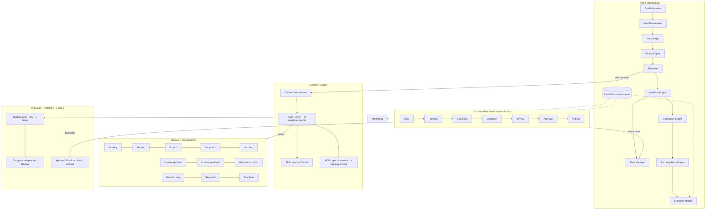

# AOS Design Specification v1 — the complete Agentic Operating System

**Design stance.** One system, two deployment profiles, so the design is 100% complete without
pretending this repository is a data center:

- **P0 · Solo** (default, exists today): zero-server, zero-dependency, files + git as the
  substrate, Claude Code as the execution engine. Everything in this spec has a P0 design.
- **P1 · Team/Server** (deferred by DEC-012 until a real multi-user need): the same contracts
  served by a thin service layer. P1 never changes a concept — only where it runs.

Already built (Milestones 1–2): kernel (planner/scheduler/state/graph), four registries,
memory layer (ranked retrieval, knowledge graph, context manager), vault-mcp (10 tools),
console v6, 34-test CI. This spec designs everything else and the target end-state.

---

## 1. Architecture diagram



**Control law (unchanged from the proven OS):** nothing reaches Publish without passing
Evaluation → Reflection (independent pass) → Approval. The kernel plans and observes; the
Execution Engine acts; Memory records; Governance gates.

## 2. Component designs

### 2.1 Kernel
| Component | P0 design (file-backed) | Status |
|---|---|---|
| Goal Interpreter | `aos goal "<text>"` → matches against charter/problem registry → structured goal record (`vault/Goals/GOAL-XXX.md`: intent, scope, deliverable, constraints, linked charter) | design |
| Goal Decomposer / Task Graph | Goal → task DAG serialized as `goals/GOAL-XXX.graph.json` (nodes = pipeline stages or custom tasks; edges = dependencies). The 19-stage pipeline is the canonical prebuilt graph | partial (pipeline graph built) |
| Priority Engine | Deadline + gate-readiness + owner-priority scoring; ties broken by pipeline order | design |
| Scheduler / Execution Planner | `aos plan` (exists) extended with `--json` for the UI; emits next-runnable set with owners and readiness reasons | partial |
| Workflow Engine | Executes nothing itself (P0): emits work orders the session/agents pick up; P1: queue + workers | by design |
| State Manager | Governing docs are canonical (exists); plus `state/events.jsonl` append-only event log (see Event Bus) | partial |
| Event Bus | Append-only `vault/_state/events.jsonl` — every stage transition, agent start/stop, verdict, approval as `{ts, actor, type, ref}`. P0 writer: session hooks + kernel; consumers: console timeline, replay, metrics | design |
| Checkpoint Engine | A checkpoint = a git commit tagged `ckpt/<goal>/<stage>` (already de-facto practice → formalized) | design |
| Recovery / Retry Engine | Resume-from-transcript for agents (proven in production this week) + `aos resume` mapping interrupted stages to their re-entry actions | partial (manual protocol proven) |
| Execution Replay | Console replays `events.jsonl` on a timeline (activity replay v2 — real event granularity) | design |
| Strategy Optimizer | Post-goal retro: lessons-learned note auto-drafted from event log + verdict deltas (extends the existing Lessons_Learned pattern) | design |

### 2.2 Agent layer
- **Registry** — exists (`registry.agents()`); add `metrics` (below) and `health`.
- **Sub-agents / parallel execution** — exists (Agent tool, proven 40+ invocations); design adds
  a per-wave concurrency budget in kernel config to respect session limits (learned this week).
- **Agent metrics** — from `events.jsonl`: invocations, verdicts issued, findings caught,
  fix-cycles triggered, token counts (when reported); rendered on console Agents view.
- **Agent health** — last-run status + interruption/resume counts; a red badge = an agent whose
  last run terminated abnormally without resume.
- **Collaboration** — the escalation contract (agent → steward → user) is already normative;
  documented as the collaboration protocol; P1 adds a message bus.
- **Marketplace** — P0: an `agents/community/` convention + `aos install-agent <path/url>`
  validating frontmatter and disclosing tool grants before copy-in (approval workflow applies).

### 2.3 Skills
Registry + versioning via frontmatter `version:` (add to all 15), dependency field
(`requires:` — e.g. deck-builder requires template-compliance-gate), marketplace = same
`install` convention with a diff-preview + explicit approval. No silent hot-load: **hot-plug
means "no restart needed," never "no approval needed."**

### 2.4 Memory hierarchy (mapping, not new stores)
| Blueprint tier | P0 realization |
|---|---|
| Working | The live session context + scratchpad |
| Session | `SESSION_LOG.md` entries + transcripts |
| Short-term | Recent-N events window over `events.jsonl` |
| Long-term / Project | `MEMORY.md`, `PROJECT_PROGRESS.md`, tracker, CHANGELOG |
| Semantic | Knowledge graph + retrieval index (built, M2) |
| Episodic | `events.jsonl` + validation reports (what happened, when, verdicts) |
| User | `vault/user.md`, `identity.md`, `soul.md` |
| Archived | Superseded/`_v1` trees + git history — never deleted, marked |

### 2.5 Second Brain & Retrieval
Exists: Vault, Decision Log, Research, Templates, graph, hybrid (BM25+metadata+graph)
retrieval with citation support. **Designed addition — semantic/vector search:** optional
embeddings index (`vault/_state/embeddings.sqlite`, built via the API path per LLM_Layer;
degrades gracefully to BM25 when absent). Relationship Engine: suggest-links pass (co-citation
+ co-occurrence) emitting *proposed* wikilinks for approval — propose-then-approve, like all
vault mutations.

### 2.6 Evaluation & Reflection (largely built — the OS's strongest suit)
Hallucination detection = citation audit (unresolvable claim = hard failure). Confidence =
the tiered confidence labels + ASM confidence column. Consistency = gates 14–16. Quality =
QA review + McKinsey lens. Reflection = fix cycles (critique→improve) + two-pass independent
review + re-verification. **Designed addition:** `aos validate` — one command bundling tests +
selftest + freshness + gate states into a machine-readable verdict (CI's job, locally).

### 2.7 Security
| Element | P0 | P1 |
|---|---|---|
| RBAC | Single-owner; roles exist as agent authority boundaries (read-only MCP, propose-then-approve) | OIDC + role claims |
| Audit | Git history + `events.jsonl` (append-only) | + server audit log |
| Encryption | At-rest = disk/repo host; no secrets in repo (enforced convention) | TLS + KMS |
| Secrets | Environment variables only (`ANTHROPIC_API_KEY` etc.); `.gitignore`d env files | Vault/KMS |
| Approval workflow | AskUserQuestion escalations + DEC records + PR review — formalized as the Approval stage of the UI workflow | + multi-approver rules |

### 2.8 Monitoring
Console views (dashboard, timeline=replay, metrics, cost) all fed by `events.jsonl` +
kernel JSON exports. Cost: per-session token/agent counts appended to SESSION_LOG (policy
exists) → aggregated by `aos metrics`. Performance: stage cycle-times from event timestamps.

### 2.9 Plugin architecture
Hot-plug agents/skills/MCP = drop-in file conventions + `aos install-*` with approval gate
(agents/skills) and `.mcp.json` entries (MCP — already hot in Claude Code). Themes: console
design tokens are CSS custom properties — a theme = a token file; ships with dark/light,
accepts custom. Widgets: console cards are self-contained components keyed by a registry
(add-a-widget = add a render function + data selector).

## 3. Folder structure (target; additive only)

```
repo/
├── app/agentic-os-console/          # UI (PWA + Tauri)  — v7 adds workflow views
├── scripts/aos/                     # kernel + memory (+ planned: events.py, validate.py, metrics.py)
├── scripts/vault_mcp/               # MCP server (10 tools; + get_events, get_validation_status)
├── vault/
│   ├── Goals/                       # NEW: GOAL-XXX records + task graphs
│   ├── _state/                      # NEW: events.jsonl, embeddings.sqlite (optional, gitignored index)
│   ├── Architecture|Decisions|Forecasts|Knowledge|Research|Validation|...   # unchanged
├── tests/                           # 34 → grows per milestone
└── .github/workflows/ci.yml
```

## 4. Data design

**Canonical store: markdown + git (P0).** Structured derivatives are *indexes, disposable and
rebuildable* — never sources of truth.

- `events.jsonl` event: `{ts, actor, type: stage_transition|agent_run|verdict|approval|publish, ref, detail}`
- `GOAL-XXX.graph.json`: `{goal, nodes:[{id, name, owner, stage_ref, status}], edges:[[a,b]]}`
- P1 schema (deferred): Postgres tables mirroring the tiers — users/roles, goals, tasks,
  events, notes(versioned), decisions, assumptions, artifacts; Elasticsearch for text; the
  markdown vault remains exportable/importable losslessly.

## 5. API design

**P0 API = the MCP surface + kernel CLI (machine-readable):**
- Existing 10 vault-mcp tools; add `get_events(since)`, `get_validation_status(section)`,
  `get_goal(id)`, `search_ranked` (done).
- `aos ... --json` on every CLI verb (status/plan/agents/metrics) — this is the console's
  live-bridge contract.
- P1 REST (deferred): `/goals`, `/plan`, `/events`, `/notes/search`, `/approvals` — same
  shapes as the JSON exports, OpenAPI-documented; GraphQL optional for graph queries.

## 6. UI design — the workflow-first console (v7)

### 6.1 Replace chat with the goal workflow
`Goal → Planning → Execution → Validation → Review → Approval → Publish` — rendered as a
persistent **workflow rail** at the top of the workspace. Each stage is a live surface, not a
message thread; "Ask the OS" remains as an assistant overlay, not the primary interface.

| Stage | Surface (wired to) |
|---|---|
| Goal | Goal card: intent, scope, constraints, linked charter (`GOAL-XXX`) |
| Planning | Task graph view (kernel `plan --json`), editable order where gates allow |
| Execution | Live agent timeline (events.jsonl): runs, resumes, interruptions |
| Validation | Verdict board: citation/QA/gate results per artifact, findings drill-down |
| Review | Side-by-side draft + findings + fix record |
| Approval | Approval queue: pending DEC escalations, AskUserQuestion prompts, sign-offs |
| Publish | Artifact list (Outputs/) + checkpoint tags + export actions |

### 6.2 Layouts
- **Desktop (three-panel):** left nav (existing sidebar) · center workspace (workflow rail +
  stage surface) · right **Inspector** (context panel: selected item's metadata, citations,
  history, actions). Inspector is new; collapsible; ⌘I.
- **Windows:** same PWA/Tauri build; Fluent-feel via tokens (acrylic-like translucency on
  panels, Segoe UI Variable when present); full keyboard map (⌘/Ctrl-K palette exists; add
  G then 1–7 to jump workflow stages, ⌘I inspector, ⌘Enter approve).
- **Tablet:** desktop layout with collapsible panels; inspector becomes a slide-over ≤1100px.
- **Android (Material 3 Expressive):** bottom navigation (Home · Goals · Agents · Memory ·
  Approvals), card-first surfaces, FAB = "New Goal", dynamic-color support mapped onto the
  token system, voice input on the Goal composer (Web Speech API), home-screen widget (PWA
  shortcut → Approvals queue). No hamburger.

### 6.3 Navigation map
```
Home (Command Center)
├── Goals ▸ GOAL-XXX ▸ [workflow rail: 7 stages]
├── OS Map · Pipeline · Sections · Gates      (existing views, unchanged)
├── Agents ▸ agent ▸ metrics/health/history
├── Memory ▸ search | graph | timeline(replay) | tiers
├── Approvals ▸ queue ▸ item ▸ approve/reject(+reason → DEC record)
└── Settings ▸ theme · tokens · keyboard · plugins
```

### 6.4 Design system
- **Tokens (exist, extended):** brand #FF5A00; categorical #E85D1F/#3B82D6/#2FA06A/#9A6BE0
  (CVD-validated both modes); status ok/warn/bad; dark-first + light; surfaces/ink scales as
  today. New semantic tokens: `--stage-active`, `--approval-pending`, `--verdict-pass/fail`.
- **Typography:** Inter/system stack (desktop), Roboto Flex (Android), JetBrains Mono/SFMono
  (code/ids). Scale 11/12.5/14/17/22/28.
- **Animation system:** 150–350ms, cubic-bezier(0.22,1,0.36,1); stage transitions slide the
  rail; verdicts pulse once; reduced-motion honored (exists). No decorative motion on data.
- **Accessibility:** WCAG AA contrast (validated), full keyboard paths, ARIA landmarks/labels
  on every view, focus-visible rings (exist), never color-alone status (exists).
- **Responsive strategy:** same breakpoints as today (1000/760px) + 1100px inspector
  breakpoint; wide content scrolls in-container.

### 6.5 Wireframe (desktop workspace, Execution stage)
```
┌────────┬──────────────────────────────────────────────┬───────────────┐
│  nav   │  GOAL-001 · Verify Business Plan              │  INSPECTOR    │
│        │  ● Goal ─ ● Plan ─ ◉ Execute ─ ○ Validate …  │  Section 8    │
│ Home   │ ┌──────────────────────────────────────────┐  │  status 🟡    │
│ Goals  │ │ 12:04 citation-audit S8   ▶ running      │  │  owner: e-c-a │
│ OS Map │ │ 12:04 qa-review S8        ▶ running      │  │  citations 41 │
│ Agents │ │ 11:58 S7 → Done (double-PASS)      ✓     │  │  history ▸    │
│ Memory │ │ 11:31 DEC-014 approved             ◆     │  │  [Open draft] │
│ Appr.✦ │ └──────────────────────────────────────────┘  │  [View audit] │
└────────┴──────────────────────────────────────────────┴───────────────┘
```

## 7. Implementation roadmap (post-approval)

| M | Scope | Acceptance criteria | Est. |
|---|---|---|---|
| ✅ M1 | Kernel + registries + tests + CI | done — 23 tests green | — |
| ✅ M2 | Memory: retrieval, graph, context | done — 34 tests green | — |
| M3 | Event bus + `aos validate` + `--json` exports + vault-mcp `get_events`/`get_validation_status` | events.jsonl written by kernel ops; every CLI verb has --json; tests ≥ 42 | 1 session |
| M4 | Console v7 phase 1: workflow rail + Execution timeline + Inspector (desktop/tablet) | 7-stage rail live on kernel JSON; replay from events; a11y pass | 1–1.5 |
| M5 | Console v7 phase 2: Approvals queue + Goals view + Android bottom-nav/M3 layer + voice input | approval → DEC record round-trip; Android layout verified | 1–1.5 |
| M6 | Agent metrics/health + cost aggregation + Strategy Optimizer retro notes | Agents view shows per-agent metrics from events | 1 |
| M7 | Plugin conventions (`install-agent/skill` with approval gate) + themes + skill versioning | third-party skill installable with diff-preview approval | 1 |
| M8 | Optional vector index (API path) + relationship-engine proposals | semantic search degrades gracefully offline | 1 |
| P1 | Server profile (REST, Postgres, RBAC, Docker/K8s) | **remains gated on a real multi-user need — reopen DEC-012** | — |

## 8. Risk assessment

| Risk | L | Mitigation |
|---|---|---|
| Session usage limits interrupt waves | High (observed) | Concurrency budget in kernel config; resume protocol (proven); checkpoint tags |
| UI scope creep vs capstone deadline | Med | Capstone precedence rule in DEC-012; M4+ only touch console, never the pipeline |
| Event log drift vs governing docs | Med | Docs stay canonical; events are observational; freshness checker cross-checks |
| Vector index adds API dependency | Low | Optional, gracefully absent (BM25 fallback) |
| Plugin surface = supply chain | Med | No silent hot-load; diff-preview + explicit approval; tool-grant disclosure |

## 9. Acceptance criteria for "100% Agentic OS"

1. Every blueprint concept maps to a shipped P0 component or an explicit P1-deferred line —
   no "unknown" cells (this spec's tables are that map).
2. Goal→Publish workflow operable end-to-end in the console against a real goal, with
   approvals writing DEC records.
3. Tests ≥ 60, CI green, `aos validate` single-command verdict.
4. Full replay of any goal's execution from the event log.
5. The capstone's own pipeline runs unchanged on top — zero regressions (the standing
   backward-compatibility proof).

## See also
[[Production_Architecture_Assessment_2026-07-24]] · [[Agentic_OS_Completeness_Assessment]] ·
DEC-012 · `scripts/aos/README.md` · `CHANGELOG.md`
