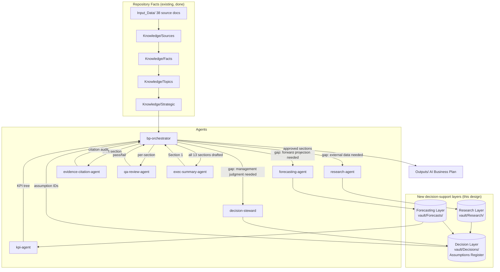

# Agentic OS Architecture — talabat Egypt Retention Capstone

**Read this first.** This document is the map of the whole operating system: what exists today,
what's missing, and the eight new agents / six new skills / three new knowledge layers that close
the gap. It is a **design specification**, produced *before* any Business Plan section is drafted,
per the explicit project decision recorded in `MEMORY.md` (2026-07-21, OS Architecture Design Phase). Companion documents:

- [[Decision_Management_Layer]] — Task 5
- [[External_Research_Layer]] — Task 6
- [[Forecasting_Layer]] — Task 7
- [[Business_Plan_Generation_Pipeline]] — Task 8 (the redesigned skill)
- [[Implementation_Roadmap]] — Task 11

---

## 1. Current architecture — assessment

*(As of commit `bac9e2e`, 21 Jul 2026, before this design work.)*

| OS component (per Capstone Guide) | Current state | Assessment |
|---|---|---|
| **Second Brain** (`vault/Knowledge/`) | 154 notes: 29 Sources, 14 Facts + 29 raw Facts fragments, 9 Entities, 30 Topics, 12 Strategic, `Relationship_Map.md`, `Business_Relationships.md` | **Strong.** Fully cited, 0 orphans, 1 connected component. This is the OS's best-built layer — it answers "what do we know," but nothing yet answers "what should we decide" or "what do we still need to find out." |
| **MOC / navigation** (`vault/MOC/`) | 13 MOCs | Strong. Navigation is solved. |
| **Memory** (`CLAUDE.md`, `MEMORY.md`, `PROJECT_PROGRESS.md`, `SESSION_LOG.md`) | All four present and current | Strong, but memory only tracks *facts and status* — it has no concept of a "decision" as a distinct, approvable, versioned object. |
| **Agents** (`.claude/agents/`) | **Did not exist before this document.** All prior multi-agent work (29-doc ingestion, Phase 4 semantic layer) used ad-hoc `general-purpose` background-agent invocations governed by one-off briefing docs, not durable, named, reusable subagents. | **Gap.** No persistent agent roster exists. Every future run of the ingestion or drafting process would require re-writing the briefing from scratch. |
| **Skills** (`.claude/skills/`) | 2: `session-end`, `business-plan-drafting` | **Gap.** `business-plan-drafting` currently assumes evidence is either "in the vault" or "a known gap to flag" — it has no mechanism to *resolve* a gap (no research step, no forecast step, no decision-escalation step). It jumps straight from "gap identified" to "write it anyway, labeled." |
| **Decision layer** | None. Open decisions live as bullet lists in `PROJECT_PROGRESS.md`/`MEMORY.md`/the project tracker — free text, not structured, versioned, or linked to the numbers they justify. | **Gap.** No auditable record of *who decided what, from what evidence, when*. |
| **External research** | None. `CLAUDE.md`'s standing instruction only says synthetic data must be *labeled*; nothing defines *how* external research is sourced, scored, or stored. | **Gap.** |
| **Forecasting** | None. No file distinguishes a disclosed historical figure from a projected one. | **Gap.** Section 9 (Financial Plan) and Section 13 (KPIs) cannot be safely drafted without this. |
| **Validation / QA** | 3 reports, all scoped to *ingestion and graph* quality (`_VALIDATION_REPORT.md`, `_AUDIT_REPORT_PHASE4.md`, `Obsidian_Graph_Cleanup_Report.md`) | **Gap.** No validation exists — or can exist — for Business Plan *content*, because no content has been drafted. The pipeline that would generate and check that content doesn't exist yet either. |
| **MCP** | Undecided (past its Phase 2 deadline, per `MEMORY.md`) | Open, tracked separately — not addressed by this document. |

**Bottom line:** the OS has a excellent *evidence base* and *no decision-making apparatus* on top of
it. Everything below exists to build that apparatus — the layer between "what the corpus says" and
"what the plan will claim."

---

## 2. Missing capabilities — catalogue

Fourteen capabilities were identified as absent. Each is mapped to the new agent(s)/skill(s)/layer
that supplies it (full designs in §3–§4 and the companion documents).

| # | Capability | Why it's missing today | Supplied by |
|---|---|---|---|
| 1 | **Decision Management** | No structured, versioned record of management judgment calls (e.g. build/buy/partner, which market-size figure to adopt) | Decision Steward Agent + `vault/Decisions/` (§ Decision Management Layer) |
| 2 | **Forecast Generation** | No mechanism to turn a historical Fact into a scenario projection with a stated method | Forecasting Agent + `vault/Forecasts/` (§ Forecasting Layer) |
| 3 | **Assumption Management** | Assumptions are currently implicit, scattered across prose ("Caution:" notes in the skill) rather than a single register | `vault/Decisions/Assumptions_Register.md`, owned jointly by the Decision Steward and Forecasting Agents |
| 4 | **External Research Integration** | No defined workflow for sourcing data the corpus lacks (AI market sizing, funnel benchmarks) | Research Agent + `vault/Research/` (§ External Research Layer) |
| 5 | **Data Validation** | Ingestion-time validation exists; nothing validates externally-sourced or forecast data before it's used | Research Agent (source-quality check) + QA/Final Review Agent (pre-publication check) |
| 6 | **Evidence Ranking** | Primary-vs-secondary ranking exists as a one-line rule in `CLAUDE.md`/`_CORPUS_INDEX.md`, not an enforced procedure | Evidence & Citation Agent, `evidence-ranking` skill |
| 7 | **Conflict Resolution** | Three known internal discrepancies are *flagged* (in the drafting skill's cautions) but there is no procedure to *resolve or formally footnote* them | Evidence & Citation Agent, same skill, writes a Decision Log entry when a conflict is resolved |
| 8 | **Citation Verification** | Manual/implicit — "every claim must trace to a note" is a stated rule, not a checked one | Evidence & Citation Agent, `citation-audit` skill (automatable grep-style pass) |
| 9 | **KPI Generation** | `Strategic/Customer Retention Drivers.md` lists drivers; nothing turns them into a monitored KPI tree with targets/thresholds | KPI & Metrics Agent |
| 10 | **Executive Summary Generation** | Section 1 is explicitly "write last" in the current skill, but no agent/procedure exists to synthesize 13 finished sections into one SCQA page | Executive Summary Agent |
| 11 | **Scenario Planning** | No base/upside/downside structure exists anywhere | Forecasting Agent, `vault/Forecasts/Scenarios.md` |
| 12 | **Recommendation Prioritization** | Multiple candidate AI interventions exist in `Strategic/AI Opportunities.md` / `Future AI Opportunities.md`; nothing ranks or selects among them with stated criteria | Decision Steward Agent (produces a Decision Log entry ranking interventions against stated criteria) |
| 13 | **Quality Assurance** | Ingestion/graph QA exists; content QA (McKinsey Lens pressure test, MECE check, style) does not | QA/Final Review Agent, Pipeline stage 11 |
| 14 | **Final Review** | No sign-off gate before a section is considered done | QA/Final Review Agent, Pipeline stage 11, checklist status in the Project tracker |

---

## 3. New Agents (`.claude/agents/`)

Eight agents, designed to be MECE against the 14 capabilities above and against each other. Each is
authored as a real `.claude/agents/<name>.md` subagent definition (this document is the design
rationale; the operative files are the `.md` agent definitions themselves, listed at the end of this
section).

### 3.1 Orchestrator Agent (`bp-orchestrator`)
- **Mission:** Run the 11-stage Business Plan Generation Pipeline (see `Business_Plan_Generation_Pipeline.md`) for one section at a time; sequence the other seven agents; hold pipeline state (which stage each section is at) in the Project tracker.
- **Inputs:** section number/name requested; `AI_Business_Plan_Template.md`; `.claude/skills/business-plan-drafting/SKILL.md`; current status table in `vault/Projects/Talabat-Egypt-AI-Retention-Business-Plan.md`.
- **Outputs:** stage-by-stage delegation calls to the other agents; an updated status row (stage reached, blockers) in the Project tracker; the section draft only once all upstream stages report clean.
- **Skills used:** `business-plan-drafting` (entry point / procedure).
- **Knowledge sources:** the Project tracker, all vault layers (read-only at this level — it delegates writes).
- **Interacts with:** every other agent below, in pipeline order.
- **Success criteria:** no section reaches "drafted" status while an upstream stage (evidence, research, forecast, decision, citation) is still open; every stage transition is logged.

### 3.2 Research Agent (`research-agent`)
- **Mission:** Resolve a named evidence gap that the corpus cannot fill, using external sources, and register the result with a confidence level.
- **Inputs:** a Research Register item (`vault/Research/Research_Register.md` row) — topic, why needed, which BP section.
- **Outputs:** a new Research Note (`vault/Research/Notes/RES-XXX_<slug>.md`, same citation discipline as a Source Note: publisher, URL, retrieval date, confidence); an updated Research Register row (status → Found/Verified); a proposed Assumption Register row.
- **Skills used:** `external-research` (new).
- **Knowledge sources:** `vault/Research/Research_Register.md`, WebSearch/WebFetch tools, `_CORPUS_INDEX.md`'s existing gap list as a starting point.
- **Interacts with:** Orchestrator (receives requests), Decision Steward (hands off the finding for assumption registration), Evidence & Citation Agent (research notes are subject to the same citation-verification pass as corpus notes).
- **Success criteria:** zero external figures enter the Business Plan without a Research Note behind them; every Research Note states publisher + date + confidence.

### 3.3 Forecasting Agent (`forecasting-agent`)
- **Mission:** Turn a historical Fact into a stated, method-transparent projection (base/upside/downside), and maintain the Value Driver Tree.
- **Inputs:** the relevant Facts (e.g. `Facts/Revenue.md`, `Facts/GMV_Facts.md`), the driver logic in `Strategic/Revenue Model.md`.
- **Outputs:** `vault/Forecasts/Value_Driver_Tree.md` node updates; `vault/Forecasts/Scenarios.md` entries; proposed Assumption Register rows (growth rates, elasticities).
- **Skills used:** `forecast-builder` (new).
- **Knowledge sources:** `Facts/`, `Strategic/Revenue Model.md`, `Strategic/Cost Structure.md`, `Strategic/Growth Drivers.md`.
- **Interacts with:** Decision Steward (a chosen growth-rate assumption is a management decision, logged there), KPI & Metrics Agent (forecast outputs feed KPI targets), Orchestrator.
- **Success criteria:** every forecast number has a named historical anchor fact, a stated growth logic, and three scenarios; no forecast is presented without its assumption ID.

### 3.4 Decision Steward Agent (`decision-steward`)
- **Mission:** Own the Decision Log and Assumptions Register; convert an open question (market-size definition, build/buy/partner, discrepancy resolution, intervention prioritization) into a structured, dated, owned Decision record.
- **Inputs:** an open question raised by any other agent or by the user; the competing evidence options.
- **Outputs:** a new `vault/Decisions/Decision_Log/DEC-XXX_<slug>.md`; an updated `vault/Decisions/Assumptions_Register.md` row; updates to the "Open decisions" list in the Project tracker.
- **Skills used:** `decision-log` (new).
- **Knowledge sources:** all four evidence tiers (Facts, Research Notes, Forecasts, prior Decisions).
- **Interacts with:** every agent that surfaces an open question; the human user (decisions requiring instructor/team judgment are drafted as *proposed*, not *approved*, until the user confirms — mirrors the existing "propose-then-approve" vault convention).
- **Success criteria:** every one of the plan's known open items (role assignment aside) has exactly one Decision record; no assumption enters a forecast or a plan section without an Assumption Register ID.

### 3.5 Evidence & Citation Agent (`evidence-citation-agent`)
- **Mission:** Rank competing evidence (primary > secondary > research > forecast > synthetic), resolve or explicitly footnote conflicts, and verify every claim in a drafted section traces to a real note/citation.
- **Inputs:** a drafted section (from the Orchestrator, pipeline stage 7 and stage 9), the relevant Facts/Sources/Research Notes.
- **Outputs:** a verification report per section (`vault/Validation/Citation_Audit_Section_N.md`); flags of any claim without a trace; a Decision Log entry when it resolves a known discrepancy (e.g. the Egypt category-share figure, the 2026 investment total).
- **Skills used:** `evidence-ranking`, `citation-audit` (both new).
- **Knowledge sources:** all vault layers plus `vault/Decisions/`, `vault/Research/`.
- **Interacts with:** Orchestrator, Decision Steward (escalates conflicts it cannot resolve by ranking alone), QA/Final Review Agent (its report is an input to final sign-off).
- **Success criteria:** 100% of numeric claims in a section have a resolvable citation chain; 0 silently-picked numbers where the corpus disagrees with itself.

### 3.6 KPI & Metrics Agent (`kpi-agent`)
- **Mission:** Build the monitored KPI tree (Section 13) from the Value Driver Tree and Section 4's value mechanisms, splitting leading vs. lagging indicators and stating which KPIs are *newly instrumented* (no baseline exists, e.g. churn) vs. *already tracked* by talabat.
- **Inputs:** `vault/Forecasts/Value_Driver_Tree.md`, `Strategic/Customer Retention Drivers.md`, Section 4 draft.
- **Outputs:** `vault/Forecasts/KPI_Tree.md`; feeds Section 13 drafting directly.
- **Skills used:** none new — operates directly against the Forecasting and Decision layers.
- **Knowledge sources:** Forecasts layer, Strategic notes.
- **Interacts with:** Forecasting Agent, Orchestrator.
- **Success criteria:** every KPI traces to a value-driver-tree node; every KPI is tagged baseline-exists / newly-instrumented.

### 3.7 Executive Summary Agent (`exec-summary-agent`)
- **Mission:** Synthesize the finished Sections 2–13 into the SCQA Executive Summary — the only agent that is explicitly blocked from running until all other sections are marked "drafted."
- **Inputs:** all 13 other section drafts.
- **Outputs:** Section 1 draft.
- **Skills used:** `business-plan-drafting` (Section 1 procedure).
- **Knowledge sources:** the finished plan itself, not the raw vault — by design, so the summary reflects what was actually decided, not a day-one guess.
- **Interacts with:** Orchestrator only (gated dependency).
- **Success criteria:** Section 1's "Answer" matches the plan's actual final recommendation; no claim in Section 1 is absent from Sections 2–13.

### 3.8 QA / Final Review Agent (`qa-review-agent`)
- **Mission:** Run the final gate on every section: McKinsey Lens pressure test (Pyramid/SCQA/MECE/hypothesis-driven), completeness against `AI_Business_Plan_Template.md`'s required sub-bullets, and the Anti-patterns checklist in the drafting skill.
- **Inputs:** a section draft plus its Citation Audit report.
- **Outputs:** a pass/fail-with-fixes review (`vault/Validation/QA_Review_Section_N.md`); flips the section's status cell in the Project tracker to ✅ only on pass.
- **Skills used:** `qa-review` (new).
- **Knowledge sources:** `AI_Business_Plan_Template.md`, the drafting skill's Anti-patterns list.
- **Interacts with:** Orchestrator (final stage before status flips to Done), Evidence & Citation Agent (consumes its report).
- **Success criteria:** no section is marked ✅ Done without a passed QA review on file.

---

## 4. New Skills (`.claude/skills/`)

Skills are the *procedures*; agents are the *actors* that run them (an agent may use zero, one, or
several skills). Six skills are new; one (`business-plan-drafting`) is redesigned, not replaced.

| Skill | Trigger | Used by | Purpose |
|---|---|---|---|
| `business-plan-drafting` (redesigned) | `/business-plan` | Orchestrator, Exec Summary Agent | Now the **pipeline entry point** — the 14-section content map stays, but it now hands off gap-filling to the other five skills instead of only flagging gaps in prose. See `Business_Plan_Generation_Pipeline.md`. |
| `external-research` (new) | `/research` | Research Agent | How to search, extract, cite, and confidence-score an external source; what counts as an acceptable provider (industry reports, official competitor disclosures, reputable press) vs. unacceptable (unsourced blogs, AI-generated summaries of unknown provenance). |
| `forecast-builder` (new) | `/forecast` | Forecasting Agent | How to build a driver-tree projection from a historical anchor: state the anchor fact, the growth logic, the confidence, and produce base/upside/downside. |
| `decision-log` (new) | `/decide` | Decision Steward | The Decision record template and workflow: propose → evidence review → (user approval where judgment-based) → approved/superseded status. |
| `evidence-ranking` (new) | internal — no user-facing trigger | Evidence & Citation Agent | **Evaluates source strength and suitability**: the primary > secondary > external-research > forecast > synthetic hierarchy, and the procedure for footnoting an unresolved conflict rather than silently picking a side. Runs *before* a claim is drafted (pipeline stage 7) — a question about which evidence to trust. |
| `citation-audit` (new) | internal — no user-facing trigger | Evidence & Citation Agent | **Verifies drafted claims are accurately supported and cited**: mechanical trace-check that every number/claim already *in a draft* → Assumption Register or Facts/Sources note → original `(DocID, page N)`. Runs *after* a claim is drafted (pipeline stage 9) — a question about whether the drafted sentence honestly reflects the evidence. Kept as a separate skill from `evidence-ranking` deliberately: ranking is a pre-drafting judgment call, auditing is a post-drafting mechanical check, and collapsing them would blur that stage boundary in the pipeline. |
| `qa-review` (new) | internal — no user-facing trigger | QA/Final Review Agent | The McKinsey Lens checklist + template-completeness checklist + Anti-patterns checklist, applied per section. |

---

## 5. Gap analysis table

| Current capability | Missing capability | Priority | Est. effort | Dependencies |
|---|---|---|---|---|
| Cited knowledge base (Facts/Topics/Strategic) | Decision Management Layer | **High** | 0.5–1 session | None — can start immediately |
| Cited knowledge base | Assumption Management (single register) | **High** | included in above | Decision Management Layer (same folder) |
| None | External Research Layer + Research Agent | **High** | 1 session | WebSearch/WebFetch tool access (available) |
| None | Forecasting Layer + Forecasting Agent | **High** | 1 session | Decision Management Layer (assumptions feed it) |
| `business-plan-drafting` skill (gap-flagging only) | 11-stage generation pipeline | **High** | 1 session | All three layers above |
| None | Evidence & Citation Agent (ranking, conflict resolution, citation verification) | **Medium-High** | 0.5 session | Decision Management Layer (writes Decision records for resolved conflicts) |
| `Strategic/Customer Retention Drivers.md` (qualitative) | KPI Generation | **Medium** | 0.5 session | Forecasting Layer (Value Driver Tree) |
| None | Executive Summary Agent | **Low (gated)** | 0.25 session | All 13 sections drafted — cannot run early regardless of when it's built |
| Ingestion/graph QA only | Content QA / Final Review Agent | **Medium** | 0.5 session | Pipeline stages 1–10 exist |
| `.claude/agents/` (empty) | 8 named, reusable agent definitions | **High** | rolled into the above (agents are built alongside their layer) | — |

Priority logic: **High** = blocks any section from being safely drafted (Sections 3/9/10/13 in
particular cannot be honestly written without Decision Management, External Research, and
Forecasting existing first — this is exactly why the user gated Business Plan drafting behind this
design phase). **Medium** = improves quality/auditability but a first-pass draft is theoretically
possible without it. **Low (gated)** = cannot be front-loaded no matter how highly prioritized,
because it structurally depends on everything else finishing first.

---

## 6. End-to-end workflow

**Reading the diagram:** the left block is finished (Phase 3). The center block is new, structured
storage — not agents, but where agents write their findings so they're version-controlled and
citable. The right block is the agent roster; the Orchestrator is the only agent that talks to the
user directly about pipeline status. No arrow points from `Corpus` straight to `OUT` — every claim
in the Business Plan must pass through at least the Orchestrator → Evidence & Citation → QA chain.

---

## 7. Cross-references

- Roadmap with git branches, phase-by-phase deliverables and completion criteria: [[Implementation_Roadmap]]
- The four-tier evidence model and decision repository structure: [[Decision_Management_Layer]]
- Research sourcing procedure and register: [[External_Research_Layer]]
- Forecasting methodology and Value Driver Tree: [[Forecasting_Layer]]
- The redesigned 11-stage pipeline (supersedes the old "flag the gap and write anyway" flow): [[Business_Plan_Generation_Pipeline]]

**Explicit scope boundary (per user instruction):** this document and its companions design the
operating system. **No Business Plan section has been drafted.** `vault/Projects/Talabat-Egypt-AI-Retention-Business-Plan.md`'s 14-section checklist remains 0/14 — see `PROJECT_PROGRESS.md` for the
current phase status.

## See also
[[Project Administration]] · [[MOC-Second-Brain]] · [[OS_Architecture_Design_Phase_Validation_Report|OS Architecture Design Phase Validation Report]]
