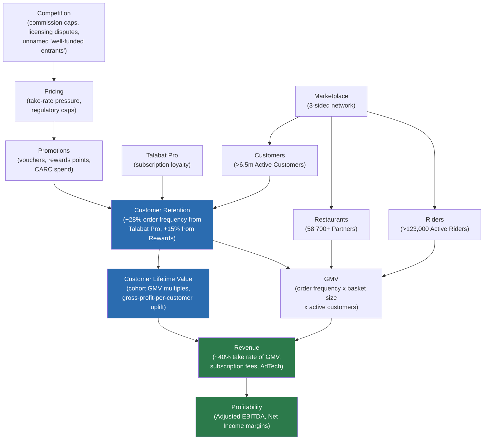

# Business Relationships — Explicit Reasoning Chains

Phase 4 companion to [[Relationship_Map]]. Where the Relationship Map explains how the whole system fits together, this note isolates the specific causal chains the capstone's retention argument depends on, each traced back to the Topic Notes and Facts that support it. Every arrow below is a claim already established elsewhere in the vault — nothing new is asserted here; this note's job is to make the *chain of reasoning* explicit and diagrammable.

## The master chain

## Chain 1: Customer Retention → Customer Lifetime Value

**Claim:** Higher retention (order frequency, tenure, loyalty engagement) compounds into higher lifetime value per customer.

**Evidence chain:**
- talabat pro subscribers show a **28% order-frequency uplift** vs. matched non-subscribers (TLB-001, page 18)
- talabat rewards first-time redeemers show a **>15% order-frequency increase within 30 days** (TLB-001, page 19)
- Multi-vertical customers (ordering food + grocery) show **significantly higher order frequency and retention**, and the FY2025 Annual Report explicitly links this to CLV-style cohort modeling: "the key inputs of the cohort models include the customer retention/reorder rate, customer activity rate, average order size" (TLB-002, page 100; TLB-004, page 43; TLB-008, page 45)
- No absolute LTV figure is disclosed anywhere in the corpus — the chain is evidenced through relative multiples and uplift percentages only

**Topic Notes:** [[Customer Retention]] → [[Customer Lifetime Value]]

## Chain 2: Customer Lifetime Value → Revenue → Profitability

**Claim:** CLV gains flow through to Revenue (via order frequency → GMV → take rate) and then to Profitability (via margin on that incremental revenue, since retention is cheaper than acquisition).

**Evidence chain:**
- 2024 GMV growth was explicitly attributed to "a 25% expansion in monthly active users **and an 8% uplift in order frequency**" (TLB-001, page 26) — frequency (a retention/CLV signal) is a named, quantified GMV driver
- Management Revenue is ~40% take rate of GMV (TLB-001, page 27) — so GMV growth mechanically drives Revenue growth
- Customer Acquisition and Retention Costs (CARC) were USD 103mn (1.4% of GMV) in 2024, rising to USD 155mn (1.6% of GMV) in 2025 (TLB-002, page 21) — retention spend is tracked as a single line specifically because it's cheaper per incremental order than pure acquisition
- Adjusted EBITDA margin was 6.7% of GMV in FY2024, 6.5% in FY2025 (TLB-001; TLB-002) — Profitability is the last link in the chain, and the corpus shows it is sensitive to exactly this dynamic (see [[Profitability]] for the Egypt-specific breakeven-to-profitable swing)

**Topic Notes:** [[Customer Lifetime Value]] → [[Revenue Drivers]] → [[Profitability]]

## Chain 3: Marketplace → Restaurants / Customers / Riders

**Claim:** The three-sided marketplace is the structural precondition for everything else — Restaurants, Customers, and Riders are not independent inputs, they're the three faces of the same network effect (the "talabat flywheel").

**Evidence chain:**
- "talabat operates a three-sided marketplace (customers, Partners, riders) generating network effects described as the 'talabat flywheel'" (TLB-001, page 4, page 15)
- As of December 2024: **>6.5 million Active Customers**, **>68,000 Active Partners** (58,700+ restaurants, 10,000+ Local Shops), **>123,000 Active Riders** (TLB-001, page 4, page 17)
- More Partners → deeper selection → attracts more Customers → justifies more Rider capacity → faster delivery → attracts more Customers. This is the flywheel logic stated directly in the source, not inferred here.

**Topic Notes:** [[Marketplace]] → [[Restaurants]], [[Marketplace]] → [[Riders]]. See [[Relationship_Map]] §1 for the full diagram of this specific sub-system.

## Chain 4: Talabat Pro → Retention → GMV

**Claim:** talabat pro is the most directly evidenced retention lever in the entire corpus, and its effect is traceable all the way to GMV.

**Evidence chain:**
- talabat pro launched UAE March 2022; by end-2024 available in 7 of 8 countries; launched Egypt February 2025 (TLB-001, page 11-12, page 19)
- Subscribers show +28% order frequency uplift (TLB-001, page 18)
- The FY2025 Annual Report names "high-value customer retention through our talabat pro subscription programme" as a strategic focus, and the 2026 objective is explicitly to "retain high and medium value customers against partial or complete churn to competition" (TLB-002, page 5, page 14)
- Order frequency rose from 6.2x (Dec 2023) to 6.7x (Dec 2024) per active customer (TLB-001, page 15), in the same period talabat pro adoption grew 2.1x (TLB-001, page 12, page 21)
- Frequency is a stated GMV driver (see Chain 2) — closing the loop from Talabat Pro to GMV

**Topic Notes:** [[Talabat Pro]] → [[Customer Retention]] → [[GMV]]

## Chain 5: Competition → Pricing → Promotions → Retention

**Claim:** Competitive pressure on commission rates and market position pushes talabat toward promotional/voucher spend, which in turn is a retention mechanism.

**Evidence chain:**
- Government-imposed commission-rate caps in Qatar and licensing disputes in Oman are named regulatory/competitive risk factors (TLB-001, page 32)
- talabat is described as facing "offline restaurants and shops," "technology giants," "integrated e-commerce companies, quick commerce providers and 'SuperApps'" as competitive pressure (TLB-001, page 32) — only the IPO Offering Memorandum names specific rivals (Deliveroo, Careem, noon, Jahez, Snoonu — TLB-026, page 146)
- CARC (which bundles talabat-funded vouchering with customer marketing) rose from USD 89mn (1.5% of GMV, 2023) to USD 103mn (1.4% of GMV, 2024) to USD 155mn (1.6% of GMV, 2025) (TLB-001, page 28; TLB-002, page 21) — vouchering/promotion spend is a tracked, rising cost line
- Promotions (talabat rewards, DineOut Deals, PostPaid) are explicitly framed as retention tools — see Chain 1's evidence on talabat rewards' 30-day frequency lift

**Topic Notes:** [[Competition]] → [[Pricing]] → [[Promotions]] → [[Customer Retention]]

**Caveat (from [[Pricing]]'s Open Questions):** the specific Egypt price point (t pro at EGP 79/month) and the elmenus-commission-undercutting claim are **not** citable from this vault's frozen Facts/Sources layer — they live only in the separate secondary corpus (`Input_Data/03_Competitors/`, `Input_Data/04_Strategy_News/`), outside this phase's citation regime. This chain is evidenced at the group level, not confirmed for Egypt specifically.

## What this note deliberately does not claim

Per the "never invent facts" rule, this note does **not** assert:
- A quantified causal coefficient anywhere (e.g. "$1 of promotion spend produces $X of retained GMV") — the corpus never discloses this
- That any of these chains have been measured/validated for **Egypt specifically** — nearly every uplift statistic above is Group-level or explicitly excludes Egypt (see [[Egypt]] and [[AI MOC]]'s "known gap" notes)
- Churn rates, since none are disclosed anywhere in the corpus (see [[Customer Churn]])

These gaps are themselves strategically important: the AI Business Plan's Egypt-specific retention recommendation will need to either (a) extrapolate from these Group-level relationships with that limitation stated, or (b) commission the primary research / synthetic data the project's standing instructions already anticipate for exactly this kind of gap.

## See also
- [[Relationship_Map]] — the broader system diagram this note's chains are drawn from
- [[Talabat MOC]] — top-level navigation
