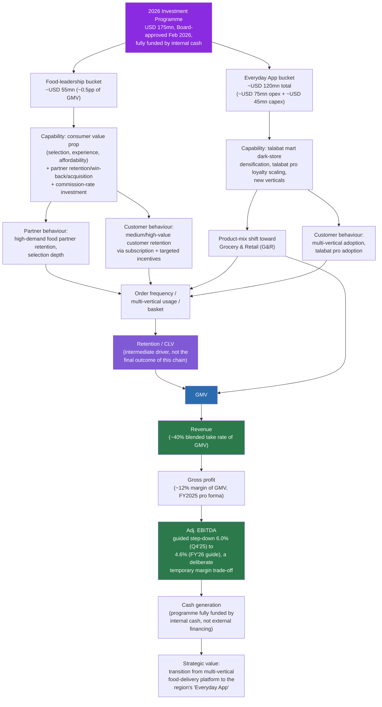

# Investment Relationship Map — 2026 USD175mn Programme

> Phase 3 companion to [[Relationship_Map]] and `Business_Relationships.md`, built for the
> 2026-07-23 pivot to the Group-wide capital-allocation problem (see `Problem_Charter.md`). Where
> the original `Business_Relationships.md` traces retention → CLV → revenue → profitability as the
> master chain, this note traces the newer, broader chain the pivot's business question actually
> asks about: **investment → capability → behaviour → GMV → revenue → gross profit → EBITDA → cash
> flow**, with retention/frequency/multi-verticality repositioned as *intermediate* value drivers
> inside that chain, not the final outcome. Every node below is drawn from evidence already in the
> vault — see citations. This note does not invent an initiative-by-initiative allocation split
> beyond what TLB-020/TLB-014 themselves disclose.

## Geography note

Every figure in this note is **Group-level** (Board-approved investment programme, disclosed as
GMV-percentage impacts, not broken out by country) unless stated otherwise. Per
`vault/Architecture/Geographic_Evidence_Rules.md`, do not treat any figure here as Egypt-specific
without an explicit, labeled inference step.

## The master chain

## Chain 1: The USD175mn programme splits into two Board-disclosed buckets

**Claim:** talabat's 2026 investment programme is not a single undifferentiated spend line — the
company itself discloses a two-bucket structure with different mechanisms and different margin
impacts.

**Evidence chain:**
- "In February 2026, the Board approved USD 175 million in investments, fully funded by internal
  cash, structured across two buckets" (TLB-020, page 16; TLB-014, page 16 carries the same
  language).
- **Bucket 1 — Food leadership:** "~USD 55mn or ~0.5pp of GMV margin impact," explicitly excluding
  the effects of the product-mix shift toward Grocery & Retail — i.e. this bucket is about
  *defending* the Food vertical, not growing G&R (TLB-020, page 16).
- **Bucket 2 — Everyday App:** "~USD 120mn total: ~USD 75mn operating investments... plus ~USD
  45mn in capital investments," covering talabat mart (integrated grocery/dark-store network),
  talabat pro (loyalty), and "new ventures" (TLB-020, page 16).
- The source itself frames Bucket 2 as "a deliberate strategic choice, made from a position of
  strength, to accelerate talabat's transition from a multi-vertical food-delivery platform to the
  region's Everyday App" (TLB-020, page 16) — this is a management framing, stated as such, not an
  independently verified outcome.

**Topic Notes:** [[2026 Investment Programme]] → [[Everyday App]], [[2026 Investment Programme]] → [[Food Leadership]]

## Chain 2: Investment buckets deploy into distinct capabilities and behaviours

**Claim:** Each bucket has a stated mechanism, not just a dollar amount — this is what turns "we
spent USD X" into a testable causal story.

**Evidence chain:**
- Food-leadership mechanism, stated directly: "Rather than matching competitor discounts and
  vouchers, we invest in the consumer value proposition: best selection, experience, and
  affordability. On the partner side, we invest in retaining, winning back, and acquiring
  high-demand food partners... reflected in commission rate investments. On the customer side, we
  focus on retaining medium- and high-value customers through our subscription programme and
  targeted incentives" (TLB-020, page 16).
- Everyday App mechanism, stated directly: "scaling talabat mart dark stores, talabat pro loyalty
  programme and new verticals... Capex deployment for dark store network densification is
  progressing broadly on plan, with some natural phasing impact from Ramadan and the regional
  conflict" (TLB-020, page 12).
- The Adj. EBITDA margin bridge on TLB-020 page 12 quantifies each mechanism's *cost* (Food
  leadership −0.2pp to −0.5pp; Everyday App opex −0.2pp to −0.7pp; product-mix shift to G&R an
  additional drag) without yet quantifying the *return* — the return side of this chain (frequency,
  retention, GMV) is evidenced qualitatively in the same sources but not yet tied to a disclosed
  ROI figure. This is a genuine evidence gap, not an oversight in this note (see Open Questions).

**Topic Notes:** [[Everyday App]] → [[Multi-Verticality]], [[Food Leadership]] → [[Customer Retention]]

## Chain 3: GMV → Revenue → Gross profit → EBITDA is the existing, disclosed financial spine

**Claim:** Once the investment chain reaches GMV, it rejoins the financial mechanics already
documented in `Business_Relationships.md` — this note does not re-derive that spine, it anchors the
new investment logic onto it.

**Evidence chain:**
- Revenue is ~40% blended take rate of GMV (TLB-001, page 27; carried forward across the corpus).
- Gross profit (pro forma FY2025): USD 1,124mn, 11.9% margin of GMV (TLB-002, pages 17, 20).
- Adjusted EBITDA margin guidance is explicitly framed as a *temporary, deliberate step-down*: "a
  calculated temporary step-down in Adj. EBITDA margins from 6.0% of GMV (Q4'25A) to a guided
  mid-range of 4.6%, to capture higher long-term growth" (TLB-020, page 16) — the corpus itself
  states this is a trade-off, not a permanent margin reset, which matters for how any forecast built
  on this chain should be scenario-framed (base/upside/downside), not treated as a single-point
  guaranteed outcome.
- The programme is "fully funded by internal cash" (TLB-020, page 16) — i.e. management discloses
  the funding source (self-funded) but the corpus does not disclose a standalone free-cash-flow
  figure isolating the programme's cash impact; see [[Cash Generation]] for what is and isn't
  disclosed at the Group cash-flow level.

**Topic Notes:** [[GMV]] → [[Revenue Drivers]] → [[Profitability]] → [[EBITDA]] → [[Cash Generation]]

## Why retention/frequency/multi-verticality are intermediate, not final, in this chain

The pre-pivot `Business_Relationships.md` treats Customer Retention and CLV as the chain's
practical endpoint, because the pre-pivot business question *was* retention. In this chain, the
same evidence (talabat pro frequency uplift, multi-vertical usage, rewards-driven frequency) still
holds and is not contradicted — but it now sits in the middle of a longer chain whose actual
endpoint is the capital-allocation question: does a dollar of investment, working through
retention/frequency/multi-verticality, produce enough incremental GMV → revenue → gross profit to
justify the disclosed EBITDA margin trade-off, across which bucket (Food leadership vs. Everyday
App), and in which markets. The corpus does not disclose an answer to that question directly — it
discloses the inputs (bucket sizes, margin costs, qualitative mechanisms) and some of the
downstream financial spine (GMV/revenue/gross-profit/EBITDA relationships), but not a
disclosed cost of incremental GMV per bucket. This gap is the central thing the Decision and
Forecasting layers (Phases 4–5) need to reason about using ranges and scenarios, not a single
computed number.

## What this note deliberately does not claim

- **No disclosed initiative-by-initiative split within either bucket.** The corpus discloses
  Food-leadership (~USD55mn) and Everyday App (~USD120mn, split ~USD75mn opex / ~USD45mn capex) —
  it does not disclose, for example, how much of the USD120mn goes specifically to talabat mart
  vs. talabat pro vs. "new verticals." Any finer split used later in this OS must be labeled an
  assumption, not treated as disclosed.
- **No disclosed ROI or payback figure for either bucket.** The margin *cost* of the programme is
  disclosed (the EBITDA bridge); the margin or GMV *return* is not disclosed as a single figure —
  only qualitative mechanism narratives and historical (pre-programme) retention-uplift statistics
  from Business_Relationships.md Chain 1/2/4, which are evidence about *how* retention has worked
  historically, not a forecast of this specific programme's return.
- **No country-level breakdown of the USD175mn programme.** All figures here are Group-level; see
  Geography note above and `vault/Architecture/Geographic_Evidence_Rules.md`.

## Open Questions

- What is the expected or historical relationship between a percentage-point of Adj. EBITDA margin
  invested and the resulting GMV growth — the corpus discloses the cost side (margin bridge) and
  narrative mechanism, not a quantified return function.
- Is the ~USD45mn capex figure a one-year (2026) figure only, or the capex component of a
  multi-year dark-store build-out — the source frames the USD175mn as a 2026 Board-approved
  programme but does not state whether 2027+ carries a comparable or different envelope.
- How does the Food-leadership bucket's "commission rate investment" interact with the
  take-rate assumption used elsewhere in the GMV→Revenue link — a sustained commission-rate
  concession to partners would mechanically compress the ~40% blended take rate, and the corpus
  does not quantify this interaction.

## Business Implications

- This chain is the correct shape for the Decision layer's "Investment Option" comparison
  (Phase 4): every candidate investment option should be traceable through capability → behaviour →
  GMV → revenue → gross profit → EBITDA → cash, the same way the two disclosed 2026 buckets are.
- Because the corpus discloses cost (margin bridge) but not return (GMV/EBITDA payback) for either
  bucket, any Forecasting-layer scenario built on this chain must show ranges and state its
  assumptions explicitly — presenting a single-point ROI number here would be false precision the
  standing instructions explicitly forbid.
- The historical retention-uplift evidence in `Business_Relationships.md` (talabat pro +28%
  frequency uplift, rewards +15%, PostPaid +14%) remains legitimate evidence for *how* the
  behaviour → frequency → GMV link has worked before — but it predates the 2026 programme and
  should be used as directional support for the mechanism, not as a forecast of this programme's
  specific magnitude.

## See also
- [[Relationship_Map]] — the original Group-level operational relationship map this note extends
- `vault/Knowledge/Business_Relationships.md` — the original retention→CLV→revenue→profitability chain (still valid evidence, now understood as the middle segment of this longer chain)
- `vault/Architecture/Geographic_Evidence_Rules.md` — governs how figures in this note may be applied to specific countries
- `Problem_Charter.md` — the business question this map is built to support

